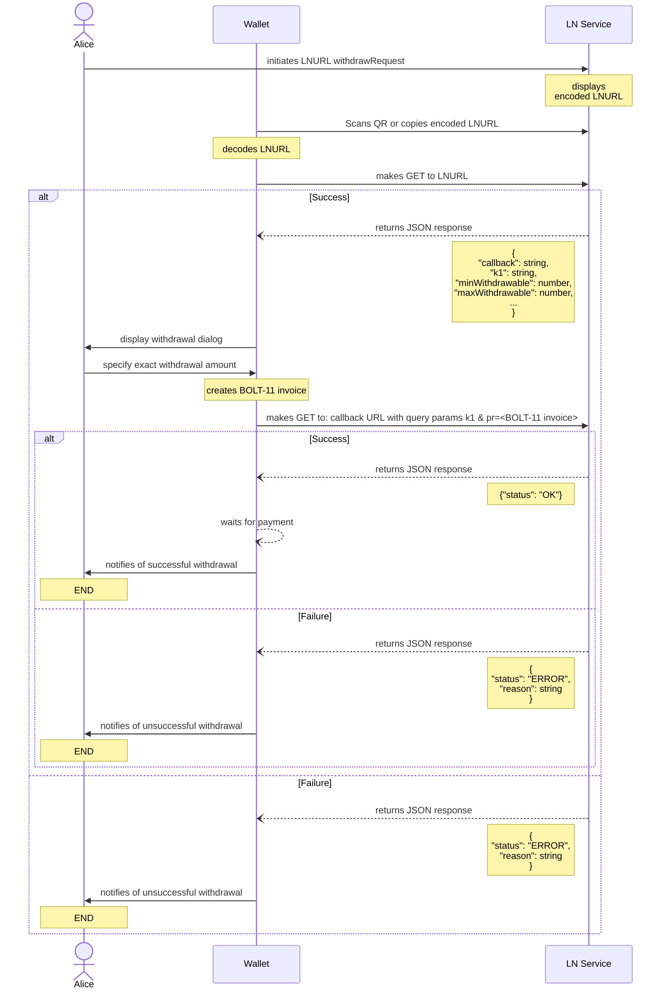

LUD-03: `withdrawRequest` base spec.
====================================

`author: akumaigorodski`
`diagram: johnpaulkiser`

---

## Withdrawing funds from a service

Today users are asked to provide a withdrawal Lightning invoice to a service. This requires some effort and is especially painful when users try to withdraw funds into mobile wallets while using a desktop website. Instead of asking for Lightning invoice a service could display a "withdraw" QR code which contains a specialized `LNURL`.

### Wallet to service interaction flow:



1. User scans a LNURL QR code or accesses an `lightning:LNURL..` link with `LN WALLET` and `LN WALLET` decodes LNURL.
2. `LN WALLET` makes a GET request to `LN SERVICE` using the decoded LNURL.
3. `LN WALLET` gets JSON response from `LN SERVICE` of form:
    ```Typescript
    {
        "tag": "withdrawRequest", // type of LNURL
        "callback": string, // The URL which LN SERVICE would accept a withdrawal Lightning invoice as query parameter
        "k1": string, // Random or non-random string to identify the user's LN WALLET when using the callback URL
        "defaultDescription": string, // A default withdrawal invoice description
        "minWithdrawable": number, // Min amount (in millisatoshis) the user can withdraw from LN SERVICE, or 0
        "maxWithdrawable": number, // Max amount (in millisatoshis) the user can withdraw from LN SERVICE, or equal to minWithdrawable if the user has no choice over the amounts
    }
    ```
    or

    ```JSON
    {"status": "ERROR", "reason": "error details..."}
    ```
4. `LN WALLET` Displays a withdraw dialog where user can specify an exact sum to be withdrawn which would be bounded by:
    ```
    max can receive = min(maxWithdrawable, local estimation of how much can be routed into wallet)
    min can receive = max(minWithdrawable, local minimal value allowed by wallet)
    ```
5. Once accepted by the user, `LN WALLET` sends a GET to `LN SERVICE` in the form of
    ```
    <callback>
      <?|&> // either '?' or '&' depending on whether there is a query string already in the callback
       k1=<k1> // the k1 specified in the response above
      &pr=<lightning invoice> // the payment request generated by the wallet
    ```
6. `LN SERVICE` sends a `{"status": "OK"}` or `{"status": "ERROR", "reason": "error details..."}` JSON response and then attempts to pay the invoices asynchronously.
7. `LN WALLET` awaits for incoming payment if response was successful.

Note that service will withdraw funds to anyone who can provide a valid ephemeral `k1`. In order to harden this a service may require authorization (LNURL-auth, email link etc.) before displaying a withdraw QR.
