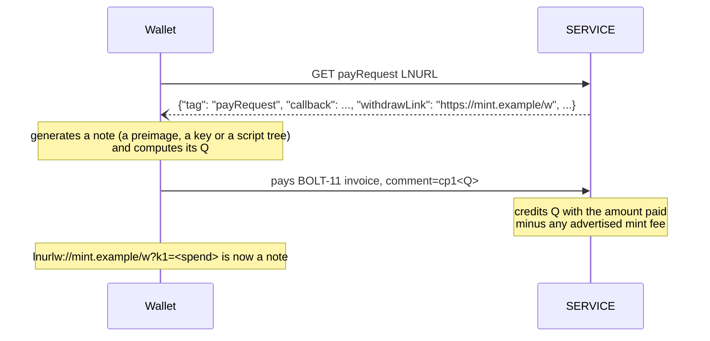
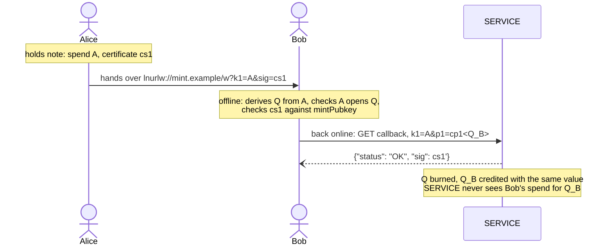
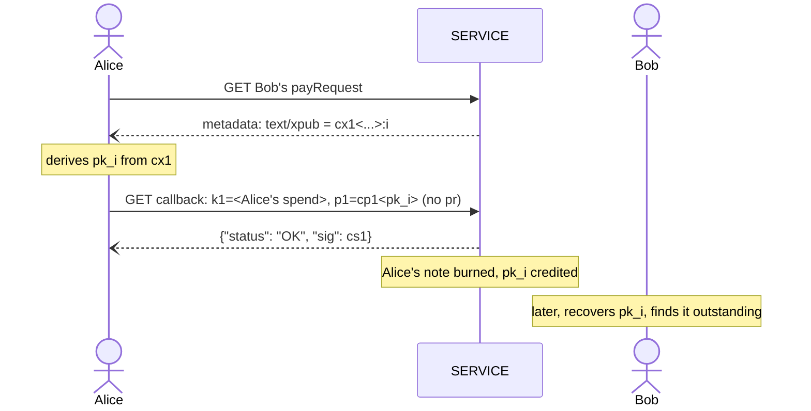

LUD-25: `LNURLcash`, Bearer assets.
====================================================

`author: dni` `status: draft`

---

## Motivation

LNURL-withdraw ([LUD-03](03.md)) links are redeemable by anyone who holds a valid `k1`. This document formalizes that property into a bearer-asset scheme: a `k1` is no longer only a one-time ticket that gets exchanged for a BOLT-11 invoice, it can *itself* be the asset. A `k1` that a `SERVICE` has credited with value can be copied, printed, NFC-tapped or handed over exactly like a banknote, and can be re-issued ("melted and re-minted"), merged with other bearer notes, or split into change.

Because a bearer `k1` is nothing more than a normal `withdrawRequest` `k1`, `LNURLcash` requires **no new endpoint**. A `SERVICE` that implements it is still speaking plain [LUD-03](03.md); a `WALLET` that does not know about `LNURLcash` still sees a normal withdraw link, echoes its opaque `k1` to the `callback` and cashes it out to a BOLT-11 invoice as usual. Redeeming a note this way is therefore fully backward-compatible. Minting one only needs a `WALLET` able to attach a [LUD-12](12.md) comment.

Every note is a [BIP-341](https://github.com/bitcoin/bips/blob/master/bip-0341.mediawiki) taproot output key `Q`, and spending it means presenting a witness that Bitcoin's own script rules accept for `Q`. The simplest note, a secret whose hash was committed at mint time, is the one-leaf hashlock case of that; a note owned by a key is its key-path case; timelocked or multi-party notes are further leaves. One lookup (`Q` → value), one verification rule and one certificate format cover all of them, and a `SERVICE` can delegate verification to Bitcoin Core's own script interpreter (`libbitcoinkernel`) instead of implementing any of it.

## Notes

### Output keys and spends

A note is identified by a 32-byte x-only taproot output key `Q`, written `cp1<Q>` (Encoding). `WALLET` generates notes itself, without contacting `SERVICE`; `SERVICE` tracks outstanding notes as `Q` → value and never needs anything secret to do so.

A note is spent by a witness that opens `Q` in one of the two ways a taproot output is spent on-chain, each with its own encoding (Encoding):

* **Key path, `ck1<...>`.** A [BIP-340](https://github.com/bitcoin/bips/blob/master/bip-0340.mediawiki) Schnorr signature by `Q` itself. The `ck1` carries `Q` alongside the signature, since a Schnorr signature does not reveal its key.
* **Script path, `cw1<...>`.** A leaf script, its control block, and the witness items the script consumes. `SERVICE` recomputes `Q` from the control block ([BIP-341](https://github.com/bitcoin/bips/blob/master/bip-0341.mediawiki)'s merkle fold and tweak) to find the note; unused leaves stay private.

This document calls either one a *spend*. A spend is the bearer secret: whoever holds it can submit it, so showing or handing over a spend is what showing or handing over a plain `k1` has always been. It goes wherever [LUD-03](03.md) puts a `k1`.

`SERVICE` MUST accept every spend that [BIP-341](https://github.com/bitcoin/bips/blob/master/bip-0341.mediawiki)/[BIP-342](https://github.com/bitcoin/bips/blob/master/bip-0342.mediawiki) consensus rules accept as input 0 of the canonical spend transaction (below), key path or any leaf script, subject only to the time rules (Timelocks) and the exception below. There is no list of permitted scripts: a `WALLET` can lock a note to any condition tapscript can express, at any `SERVICE`, without asking what it supports.

The one exception is tapscript's upgrade hooks, which consensus accepts unconditionally today and Bitcoin nodes only refuse by relay policy. `SERVICE` MUST reject a spend whose leaf version is not `0xc0`, or whose leaf contains any `OP_SUCCESSx` opcode outside pushed data. Without this, such a leaf would be spendable by anyone who sees it, and no new opcode could ever be given a meaning in `LNURLcash`. `WALLET` MUST NOT use a public key that is neither empty nor 32 bytes in a signature check ([BIP-342](https://github.com/bitcoin/bips/blob/master/bip-0342.mediawiki)'s upgradable key types), since consensus lets any signature pass against one.

### Bearer notes

The plainest note is a secret nobody but its holder knows. `WALLET` generates a random 32-byte `preimage`, computes `h = sha256(preimage)`, and builds

```
leaf    = OP_SHA256 <h> OP_EQUAL                      // a8 20 <h> 87
Q       = x(lift_x(H) + tagged_hash("TapTweak", H || tapleaf_hash(leaf))·G)
control = (0xc0 | parity(Q)) || H
```

where `H` is [BIP-341](https://github.com/bitcoin/bips/blob/master/bip-0341.mediawiki#constructing-and-spending-taproot-outputs)'s own nothing-up-my-sleeve point `50929b74c1a04954b78b4b6035e97a5e078a5a0f28ec96d547bfee9ace803ac0`, so the note has no key path at all, and `tapleaf_hash` uses leaf version `0xc0`. Its `cw1` is the script-path spend with witness `[preimage]`: revealing the secret spends the note, with no signature. This is what a plain [LUD-03](03.md) `k1` has always been, a secret that is the money, now with a public `Q` that `SERVICE` can certify (Offline verification). Test vector 5 walks through one.

#### Short forms

Everything in a bearer note except the preimage follows from `h`: the leaf, `H`, the control block and `Q`. So a `WALLET` never has to build the script itself; it MAY send plain hex and let `SERVICE` build the hashlock for it. `SERVICE` MUST accept both short forms:

* **`k1` short form.** Wherever a spend is expected, 64 hex characters are the 32-byte `preimage`. `SERVICE` builds the bearer note's `cw1` from it (the leaf and control block above, witness `[preimage]`, locktime 0, sequence `0xffffffff`) and handles it exactly like that `cw1`.
* **`cp1` short form.** Wherever a `cp1` is expected (a mint `comment`, `p1`/`p2`, `?p=`), 64 hex characters are `h`. `SERVICE` computes the bearer note's `Q` from it and handles it exactly like `cp1<Q>`.

Hex is accepted in either case and MUST be exactly 64 characters; no `cp1`, `ck1` or `cw1` has that length, so they can never be confused. A short form is only an encoding: `SERVICE` stores, looks up, certifies and burns the resulting `Q` like any other note, and a note minted with one form can be spent with the other.

The short forms keep a bearer note as compact as a plain [LUD-03](03.md) `k1` (64 characters instead of 192 for its `cw1`), and let a `WALLET` that knows nothing of taproot create and redeem notes with nothing but sha256.

### Key-path notes

A note may instead be owned by a key: `WALLET` generates `sk`, uses `Q = x(sk·G)` (negating `sk` first whenever `sk·G` has odd `y`, as [BIP-340](https://github.com/bitcoin/bips/blob/master/bip-0340.mediawiki) requires), and spends by signing. `Q` is used as is, without the empty-tree tweak [BIP-86](https://github.com/bitcoin/bips/blob/master/bip-0086.mediawiki) applies on-chain: that tweak guards against a co-signer hiding a script path in an aggregate key, which cannot happen to a key only its holder controls, and leaving it out is what lets Seed & derivation's watch-only export enumerate every note. A `WALLET` using a key aggregated from several parties SHOULD commit to a script tree (or an empty one) instead.

The signature is over the canonical spend transaction (below) for this `SERVICE`'s domain, with locktime 0 and sequence `0xffffffff`. Nothing in that message depends on the note's value or on time, so a key needs only one signature per `SERVICE`, computed once and reused for every redemption and every offline check. `WALLET` SHOULD sign with an all-zero [BIP-340](https://github.com/bitcoin/bips/blob/master/bip-0340.mediawiki) `aux_rand`, making the whole `ck1` a deterministic function of `sk` and the domain, reproducible on recovery from seed alone (test vector 3).

### Timelocks

A `cw1` carries the spend's claimed `nLockTime` and `nSequence`, and signatures in its leaf are [BIP-342](https://github.com/bitcoin/bips/blob/master/bip-0342.mediawiki) signatures over the canonical spend transaction, so they commit to both. That is what makes `OP_CHECKLOCKTIMEVERIFY` and `OP_CHECKSEQUENCEVERIFY` meaningful without a chain: the redeemer signs a time claim, the script checks the claim, and `SERVICE` checks the claim against its own clock, the same split a Bitcoin node makes between a script and its chain tip. `SERVICE` MUST reject a script-path spend whose non-zero `nLockTime` is in the future, or whose `nSequence` enables a relative lock that has not yet elapsed since `SERVICE` credited the note (by mint, rotate, split or merge). A non-zero `nLockTime` MUST be a Unix time (at least 500,000,000) and an enabled relative lock MUST carry [BIP-68](https://github.com/bitcoin/bips/blob/master/bip-0068.mediawiki)'s time-type flag; block heights and block counts have no meaning here and MUST be refused.

> [!WARNING]
> A timelock honored by `SERVICE` is `SERVICE` asserting its own clock. It is a custodial policy, not a consensus guarantee, and MUST NOT be presented as trustless.

### The canonical spend transaction

Bitcoin signatures do not sign free-form messages; they sign a hash of the transaction spending them. So that every spend can be checked by an off-the-shelf taproot verifier such as `libbitcoinkernel`, every note is spent as input 0 of one fixed, never-broadcast transaction:

| Field          | Value                                                                |
|----------------|----------------------------------------------------------------------|
| `nVersion`     | `2`                                                                  |
| `vin[0]`       | prevout `(tagged_hash("LNURLcash/mint", domain), 0)`, empty `scriptSig`, `nSequence` as claimed |
| `vout[0]`      | value `0`, empty `scriptPubKey`                                      |
| `nLockTime`    | as claimed                                                           |
| spent output   | `(OP_1 <Q>, 0)`                                                      |

#### What a signature signs

A signature in a spend, `ck1` or `cw1`, does not sign a text message such as `"LNURLcash"`. It signs the 32-byte BIP-341 signature hash of input 0 of the transaction above, exactly as it would to spend a real taproot output:

```
sighash = tagged_hash("TapSighash", 0x00 || SigMsg)
```

`0x00` is BIP-341's epoch byte and `tagged_hash(tag, x) = sha256(sha256(tag) || sha256(tag) || x)`. `SigMsg` is the concatenation of these fields ([BIP-341, common signature message](https://github.com/bitcoin/bips/blob/master/bip-0341.mediawiki#common-signature-message)), integers little-endian:

| Field               | Bytes | Value here                                                              |
|---------------------|-------|-------------------------------------------------------------------------|
| `hash_type`         | 1     | `0x00` (`SIGHASH_DEFAULT`)                                              |
| `nVersion`          | 4     | `2`                                                                     |
| `nLockTime`         | 4     | the claimed locktime; `0` for a key path                                |
| `sha_prevouts`      | 32    | `sha256(tagged_hash("LNURLcash/mint", domain) ‖ u32 0)`: **binds the mint** |
| `sha_amounts`       | 32    | `sha256(i64 0)`                                                         |
| `sha_scriptpubkeys` | 32    | `sha256(0x22 ‖ OP_1 ‖ 0x20 ‖ Q)`: **binds the note**                    |
| `sha_sequences`     | 32    | `sha256(u32 nSequence)`; `0xffffffff` for a key path                    |
| `sha_outputs`       | 32    | `sha256(i64 0 ‖ 0x00)`                                                  |
| `spend_type`        | 1     | `0x00` key path, `0x02` script path                                     |
| `input_index`       | 4     | `0`                                                                     |

A script-path signature appends [BIP-342](https://github.com/bitcoin/bips/blob/master/bip-0342.mediawiki#signature-validation)'s extension: `tapleaf_hash(leaf) ‖ 0x00 ‖ 0xffffffff` (key version, no `OP_CODESEPARATOR`). A leaf signature with a hash type other than `SIGHASH_DEFAULT` changes the fields as BIP-341 specifies.

So only three things ever reach a signature: which mint (the prevout), which note (`Q`), and, for a script path, the claimed time. Everything else is constant. Implementations need not build `SigMsg` by hand: any BIP-341 signer or verifier handed this transaction and its spent output `(OP_1 <Q>, 0)` computes the same hash, and test vector 3 lists every field so one can check.

This hash is distinct from every other hash in this document: `tagged_hash("LNURLcash/derive", ...)` only derives keys (Seed & derivation), the registration proof signs `sha256("LNURLcash:register:...")` (Lightning Address auto-mint), and `SERVICE`'s `cs1` signs a Lightning signed message (Offline verification). None of them is ever a `ck1` signature.

`domain` is `SERVICE`'s full domain name, lowercased, the same string [LUD-05](05.md) hashes. Binding it into the prevout means a signature one `SERVICE` has seen can never be replayed at another. The spent amount is always `0`: `SERVICE` enforces a note's value from its own records, and leaving it unsigned lets a key sign for a note before knowing its exact post-fee value. Key-path signatures MUST use `SIGHASH_DEFAULT` (64 bytes); leaf signatures may use any hash type consensus allows. The witness stack is `[sig]` for a key path and `[*witness, script, control]` for a script path, verified with every consensus script verification flag (P2SH, witness, taproot, `CHECKLOCKTIMEVERIFY`, `CHECKSEQUENCEVERIFY`, `DERSIG`, `NULLDUMMY`).

A spend whose leaf checks no signature, such as a bearer note's, is bound to no `domain`: whoever holds it can redeem it anywhere the note exists.

### Encoding

Every value this document introduces, other than `mintPubkey` and the bearer note's short forms (Short forms), is [BIP-350](https://github.com/bitcoin/bips/blob/master/bip-0350.mediawiki) bech32m under its own human-readable part. `ck1`, `cw1`, `cs1` and `cx1` exceed the 90-character total length [BIP-173](https://github.com/bitcoin/bips/blob/master/bip-0173.mediawiki) specifies for segwit addresses; that limit is not adopted here, the same departure BOLT-11 invoices already make.

* `cp1<...>`: a note's 32-byte output key `Q`. 61 characters, so it fits the 64-character [LUD-12](12.md) `comment` minting requires. `SERVICE` MUST reject a `cp1` whose `Q` is not the x coordinate of a curve point: no spend could ever open it.
* `ck1<...>`: a key-path spend, `Q (32) || sig (64)`. 163 characters. It carries no time claim: a key-path spend always claims locktime 0 and sequence `0xffffffff`. `SERVICE` MUST reject a payload of any length but 96 bytes.
* `cw1<...>`: a script-path spend (integers big-endian):
  ```
  u32 locktime || u32 sequence
  || (u16 len || item)* over: script, control block,
     then the witness items bottom of stack first
  ```
  A bearer note's `cw1` is 192 characters. `SERVICE` MUST reject a payload whose length prefixes do not consume it exactly, or that lacks a script or control block.
* `cs1<...>`: `SERVICE`'s certificate that a note was issued for an amount (Offline verification), a 65-byte recoverable ECDSA signature `r ‖ s ‖ recovery-id`. Its human-readable part carries the amount the way a BOLT-11 invoice's does: `cs` followed by an amount and multiplier, decoded per [BOLT-11](https://github.com/lightning/bolts/blob/master/11-payment-encoding.md#human-readable-part)'s rules (e.g. `cs10n<...>` for 1000 msat).
* `cx1<...>`: a watch-only export of a derivation branch (Seed & derivation), its public key `P` (32 bytes) concatenated with its chain code (32 bytes). 112 characters. Never part of a mint interaction.

## Minting a note from a `payRequest`

A `payLink` ([LUD-06](06.md)) may advertise that paying it mints a note, by pointing to the `withdrawRequest` endpoint:

```diff
 {
   "tag": "payRequest",
   "callback": string,
   ...
+  "metadata": "[[\"text/plain\", \"Mint fees: <base_fee_msat>,<fee_percent_ppm>\"]]",
+  "withdrawLink": string,
+  "commentAllowed": 64
 }
```

* `withdrawLink` is a raw, non bech32-encoded URL as described in [LUD-17](17.md), pointing at the `SERVICE`'s `withdrawRequest` LNURL endpoint. Appending `?k1=<spend>` to it yields a note.
* `commentAllowed` (as [LUD-12](12.md) defines) MUST be at least 64.

Before paying, `WALLET` attaches `comment = cp1<Q>` for a note it has generated, or a bearer note's hex `h` (Short forms). `SERVICE` MUST reject a mint payment whose `comment` is neither with `{"status": "ERROR", "reason": string}`, before any invoice is issued. Once the payment settles, `SERVICE` MUST credit an outstanding note at `Q`. `SERVICE` only ever learns `Q`: nothing it sees at mint time lets it spend the note.

Nothing here needs `WALLET` to implement `LNURLcash`, only plain [LUD-12](12.md) comments: a holder can generate a note and hand only its `cp1` to anyone, even someone with an entirely ordinary Lightning wallet, to paste into `comment` and pay, exactly like handing them an invoice to settle on your behalf. That payer never learns the spend, so the note remains claimable only by whoever generated it.

If the `payLink` is published as a Lightning Address ([LUD-16](16.md)) at `https://<domain>/.well-known/lnurlp/<identifier>`, a `SERVICE` MAY instead publish its withdraw LNURL at the matching `https://<domain>/.well-known/lnurlw/<identifier>` (`_` for the default identifier), the withdraw-side mirror of that same [LUD-16](16.md) convention.

`SERVICE` MAY signal a fee it withholds on minting with an extra `metadata` entry. `base_fee_msat` is a flat amount withheld from every mint, `fee_percent_ppm` is withheld on top of it in parts-per-million of the amount paid, e.g. `Mint fees: 1000,2000` means a flat 1 sat plus 0.2% of the invoice amount. A `WALLET` that recognizes the `Mint fees: ` prefix can display the expected note value before paying: `amount - base_fee_msat - amount * fee_percent_ppm / 1_000_000`. The authoritative value is `maxWithdrawable` at the informational GET once the payment settles. This covers the routing cost `SERVICE` incurs when the note is eventually melted and gives operators an incentive to run a mint. A `SERVICE` that omits this entry is assumed fee-free.

`SERVICE` SHOULD implement plain [LUD-21](21.md) `verify` on the mint `payRequest`, so `WALLET` can check when a mint or melt has settled.



## Redeeming a note

Prefixed with the `lnurlw://` scheme ([LUD-17](17.md)) or bech32-encoded as an ordinary LNURL, `<withdraw LNURL>?k1=<spend>` *is* the note. It MAY carry `&amount=<msat>`, so a recipient can display its value without contacting `SERVICE`, and `&sig=<cs1>` (Offline verification). `SERVICE` MUST ignore both at the informational endpoint; the authoritative value is always `maxWithdrawable` there.

A GET to the note's LNURL itself (the initial [LUD-03](03.md) step) is purely informational: `SERVICE` decodes the spend, finds its `Q`, and MUST verify the spend in full before answering, so a `WALLET` checking a received note learns whether the spend it holds actually opens it, not only whether `Q` is outstanding. A spend whose time claim is not yet due is answered with that reason; its note can still be looked up with `?p=` (Checking a note without exposing it). The `k1` in the response MUST be the echoed `k1`, so a `WALLET` can copy it directly into the `callback` request.

Backward compatibility is achieved by keeping the callback semantics of [LUD-03](03.md) untouched for the case a `WALLET` provides a single `k1` and a `pr`. `LNURLcash` extends the callback with the remaining combinations:

| `k1` present | `pr` present | `amount` present | Result                                                             |
|--------------|--------------|-------------------|---------------------------------------------------------------------|
| one          | yes          | -                 | standard [LUD-03](03.md) melt: the note is burned, `pr` gets paid; to melt several notes, **merge** first |
| one          | no           | no                | **rotate**: the note is burned, a note of the same value is minted at `p1` |
| one or many  | no           | yes               | **split**: all given notes are burned, two are minted, `p1` worth `amount`, `p2` worth the remainder |
| many         | no           | -                 | **merge**: all given notes are burned, one worth their sum is minted at `p1` |

These semantics apply **only to the `callback` URL** obtained from the `withdrawRequest` JSON.

### Callback request format

```
<callback>
  <?|&> k1=<spend>          // ck1, cw1 or a bearer note's hex preimage; repeat to merge
  [&amount=<msat>]          // only meaningful without pr, to split off change
  [&pr=<bolt11 invoice>]    // melt: pay this invoice from a single note, as in LUD-03
  &p1=<cp1>                 // or hex h; required for rotate/split/merge: the resulting note
  &p2=<cp1>                 // or hex h; required for split: the change note
```

`WALLET` generates every resulting note itself and discloses only its `cp1`, which `SERVICE` MUST validate as for minting; `SERVICE` credits it at that `Q` directly and never sees, generates or needs its spend. `p1` MUST be present on every request that lacks `pr`, and `p2` MUST additionally be present whenever `amount` is; `SERVICE` MUST reject a request missing either with `{"status": "ERROR", "reason": string}`. A `p1`/`p2` whose `Q` is already outstanding or was previously burned MUST be rejected with `{"status": "ERROR", "reason": "already in use"}`: crediting into it would merge value into a note someone else may hold the spend for.

One request may freely combine notes of any kind: key-path, bearer and other script-path spends alike.

### Checking a note without exposing it

`SERVICE` MUST additionally accept `?p=<cp1>` (or a bearer note's hex `h`) in place of `?k1=` on the informational GET, **and only there, never at the `callback`**. The response is the same shape [LUD-03](03.md) already defines for the informational GET with `k1` omitted.

### Responses and burning

The callback response is the plain [LUD-03](03.md) success response: `{"status": "OK"}`, extended by Offline verification. A spend that does not verify, or that opens an unknown or already-burned `Q`, MUST yield `{"status": "ERROR", "reason": string}`, unless it's a retry of a mutation `SERVICE` already completed (below); if *any* spend in a multi-`k1` request fails, the whole request MUST fail and no note may be burned or minted. `SERVICE` MAY give a specific reason when a spend verifies structurally but a script condition is not yet met (a timelock not reached): the spend is already disclosed in the request, so explaining its failure reveals nothing further.

As in plain [LUD-03](03.md), a melt's `pr` is paid out asynchronously after `{"status": "OK"}` is returned, so `SERVICE` MUST NOT burn a melted note until that outgoing payment actually settles. In the meantime the note MUST be marked pending: `SERVICE` MUST reject any other callback request naming it (another melt, a rotate, a split, a merge) with `{"status": "ERROR", "reason": "pending"}`. Once the outgoing payment settles, `SERVICE` finalizes the burn; if it fails, `SERVICE` MUST clear the pending mark and restore the note to outstanding exactly as before the attempt.

A burn is permanent: once a `Q` is burned, `SERVICE` MUST NOT return it to the outstanding set, credit it with new value, or reissue it. The only exceptions are restoring a pending note whose melt failed to settle, which never left the set, and answering a retried mutation.

### Retrying a mutation

**A retried rotate, split or merge MUST be answered as a replay, not an error.** A GET gets retried by transports that never ask `WALLET`'s permission first: an HTTP client's timeout-retry logic, a proxy, a flaky connection resending a request it never saw a reply for. If the set of `Q`s an incoming request burns, its `p1`, `p2` and `amount` all match a burn `SERVICE` already completed, `SERVICE` MUST return the same success response it returned the first time. Matching is on the decoded `Q`s, not the raw strings, since one note may be opened by more than one valid spend (another leaf, another signature, a short form). A request that repeats the burned `Q`s but disagrees on `p1`, `p2` or `amount` is a genuine conflict and gets the plain already-spent error.

### Mint fees for split and merge

If `SERVICE` advertises a mint fee, it MUST also apply the flat `base_fee_msat` to every **split** (deducted from the change, never from the requested `amount`) and refund `(n - 1) * base_fee_msat` into the result of a **merge** of `n` notes; `fee_percent_ppm` is not reapplied to either, it was already withheld once at mint time. This stops a holder from splitting a note into many dust notes for free and melting each separately to pocket the gap between `SERVICE`'s real per-melt routing cost and the single fee it collected at mint time. If the change would end up worth less than `base_fee_msat`, `SERVICE` MUST fail the split with `{"status": "ERROR", "reason": "insufficient value"}`.

### URL length limits

**A merge is bounded by ordinary URL length limits, not by anything in this document.** Browsers, HTTP servers and proxies commonly cap a URL around 2000 characters. A bearer note's hex short form costs about 68 bytes per note (`k1=`, 64 characters, `&`), room for 20-30 per merge; a `ck1` about 168, room for 8-12; a bearer note's full `cw1` about 196, room for 7-10; other `cw1`s more. A `WALLET` holding more notes than fit SHOULD merge them in batches, folding the result of one merge into the next; `SERVICE` MAY reject an oversized request outright with `{"status": "ERROR", "reason": "too many k1"}` rather than let it be silently truncated upstream.

## Offline verification

Every note has a public `Q`, so `SERVICE` can certify any note, a bearer note included, without disclosing its spend. `SERVICE` SHOULD do so.

`SERVICE` publishes its signing key as `mintPubkey` (33-byte compressed secp256k1 public key, hex) in its `withdrawRequest` JSON response. It SHOULD be the node id `SERVICE` signs its BOLT-11 invoices with, so a `WALLET` that paid a mint invoice already knows it.

```diff
 {
   "tag": "withdrawRequest",
   ...
+  "mintPubkey": string, // 33-byte compressed secp256k1 pubkey, hex
+  "sig": string         // cs1<...> for the queried note
 }
```

A certificate is a `cs1`: a recoverable ECDSA signature with deterministic ([RFC6979](https://www.rfc-editor.org/rfc/rfc6979)) nonces, produced the way [LUD-13](13.md) signs, over

```
message = "LNURLcash:" || string(amount_msat) || ":" || hex(Q)
digest  = sha256(sha256("Lightning Signed Message:" || message))
```

`hex(Q)` is lowercase. `amount_msat` is the plain integer's minimal base-10 form; a verifier decodes it from `cs1`'s human-readable part first, then rebuilds `message` from the resulting integer. A Lightning node's own `signmessage` API already produces this signature; `SERVICE` reorders its 65 bytes from `signmessage`'s recovery-id-leading layout into `r ‖ s ‖ recovery-id` before encoding.

`SERVICE` hands out certificates as `sig` on the informational GET (for the queried note) and on every rotate, split or merge:

```diff
 {
   "status": "OK",
+  "sig": string,   // cs1<...> for p1
+  "sig2": string   // cs1<...> for p2, present if p2 was supplied
 }
```

A certified note travels as `lnurlw://mint.example/w?k1=<spend>&sig=<cs1>`. To verify it offline, a recipient:

1. decodes the `k1` and derives `Q` from it (a key path names it, a script path's control block determines it, a hex preimage determines it as in Short forms);
2. checks that the spend opens `Q`, as `SERVICE` would (Output keys and spends), against the canonical spend transaction for the note URL's domain, leaving only its time claims to `SERVICE`'s clock;
3. decodes `amount_msat` from `cs1`, rebuilds `message` with `Q`, recovers a key from `cs1`, and compares it with the `mintPubkey` it has on record for that `SERVICE`.

A match proves that `SERVICE` issued this note for this amount and that the spend opens it.

> [!WARNING]
> **What this does and does not prove.** A certificate proves issuance, not that the note is still outstanding: the previous holder of a spend still knows it, and could race to redeem it. Only an online rotate closes that window, so a new holder SHOULD rotate as soon as it is back online.

### Offline circulation

Because a note is self-contained, holders can exchange notes directly, with no connectivity to `SERVICE` at the time of the exchange. The receiving `WALLET` only needs to reach `SERVICE` once it is back online, at which point it SHOULD immediately rotate (or merge, if it already holds other notes from the same `SERVICE`) the received notes into fresh ones it alone knows.



A `WALLET` that does not implement `LNURLcash` handles a received note as an ordinary withdraw link, redeemed to a `pr` of its choosing.

## Seed & derivation

`WALLET` SHOULD derive its key-path notes deterministically. The branch root for a given `SERVICE` is derived hardened, reusing the exact domain-hashing steps [LUD-05](05.md) already defines for its `linkingKey`, under a separate purpose so the two never share key material:

```
cashHashingKey   = derive(masterKey, m/139'/0)                      // LUD-05's step 1, own purpose
domainMaterial   = hmacSha256(cashHashingKey, full SERVICE domain)   // LUD-05's steps 2-3, unchanged
(d1, d2, d3, d4) = first 16 bytes of domainMaterial as 4 uint32      // exactly as LUD-05
p, chaincode     = derive(masterKey, m/139'/d1/d2/d3/d4)             // this SERVICE's branch root, hardened
P                = p·G
```

Individual note keys are then derived from that branch root *non-hardened*, with the same parity handling [BIP-341](https://github.com/bitcoin/bips/blob/master/bip-0341.mediawiki) uses to tweak an x-only key:

```
t     = tagged_hash("LNURLcash/derive", P || chaincode || ser32(i))  (mod n)
Q_i   = lift_x(P) + t·G
pk_i  = x(Q_i)                        // the note's Q, computable from (P, chaincode) alone
sk_i  = p + t          (mod n)        if P has even y
sk_i  = (n - p) + t    (mod n)        otherwise
```

`i` is a per-`SERVICE` counter `WALLET` increments once per key it derives, a mint's key or a rotate/split/merge's replacement key alike.

To recover on a fresh install from seed alone, `WALLET` re-derives `pk_0, pk_1, ...` for each known `SERVICE` and GETs the withdraw LNURL with `?p=cp1<pk_i>`, stopping after some gap limit of consecutive unknown indices, the same convention HD wallets use for address recovery; it may jump ahead and binary-search the boundary instead of walking it one by one. Since each key's key-path `ck1` is deterministic, the recovered notes are spendable immediately. `SERVICE` MAY rate-limit this scan, in-band as `{"status": "ERROR", "reason": "rate limited"}`, since [LUD-01](01.md) makes HTTP status codes meaningless here. `WALLET` MUST NOT count a rate-limit response towards the gap limit.

Recovery covers key-path notes only. A bearer note or a script-path note needs its preimage or script tree, which the seed does not determine; `WALLET` MUST back those up by other means, or rotate them into key-path notes.

Because the index-level derivation is non-hardened, `WALLET` can hand out `cx1<P || chaincode>` for a `SERVICE`'s branch, an xpub for notes, to a companion device, bookkeeping tool or point-of-sale terminal that should enumerate and watch its notes without ever being able to spend them.

### Lightning Address auto-mint

`SERVICE` MAY be handed a `cx1` to act on, not just watch: once `WALLET` registers one against a chosen `username`, `SERVICE` publishes an ordinary Lightning Address ([LUD-16](16.md)) at `https://<domain>/.well-known/lnurlp/<username>` and mints automatically for every payment it receives there, deriving the next unused `pk_i` itself and crediting the note at it, exactly as if `WALLET` had supplied `comment = cp1<pk_i>`. `WALLET` discovers what arrived the same way it recovers any note.

Registering, or later unregistering, a `username` against a `cx1` MUST always be proven, never merely asserted: `cx1` alone is public, so `SERVICE` MUST require a [BIP-340](https://github.com/bitcoin/bips/blob/master/bip-0340.mediawiki) Schnorr signature with the branch's index-0 key `sk_0` over `sha256("LNURLcash:register:" || domain || ":" || username)` (or `:unregister:`), `domain` being `SERVICE`'s own full domain name, and reject the request unless it verifies against `pk_0`, which `SERVICE` derives from the `cx1` itself. Binding `domain` stops a proof captured by one `SERVICE` from being replayed against another. Registering a fresh `username` proves control of the new `cx1`; overwriting an already-registered one proves control of the branch currently on file, not of the new `cx1` being switched to.

This is the one place `SERVICE` picks an index on its own, and its "next unused" is only ever a guess: `WALLET` may have derived that same `pk_i` for a mutation it hasn't submitted yet. Before crediting an auto-mint at `pk_i`, `SERVICE` MUST confirm it is neither outstanding nor previously burned, and skip to the next index otherwise. A mutation that later names an index `SERVICE` has meanwhile auto-minted into gets the `already in use` error (Callback request format), and `WALLET` retries at the next index.

> [!WARNING]
> If a device holding some `sk_i` on this branch is ever compromised by other means (malware, bad RNG, disk theft) while `cx1` for that branch is public, every other note on the branch is compromised too, exactly as for any shared non-hardened xpub.

## Internal transfer

If a payee registered a `cx1`, `SERVICE` SHOULD publish it in their `payRequest` metadata, the same way [LUD-16](16.md) publishes `text/identifier`, appended with `:<i>`, its best-known next-unused index for that branch:

```
[
    "text/xpub", // this payLink's mint accepts internal transfers
    content // the payee's cx1<...>:<i>
]
```

A `WALLET` already holding a note on that same `SERVICE` MAY skip Lightning entirely: derive `pk_i` from `cx1` starting at `i`, then issue an ordinary rotate, split or merge naming `cp1<pk_i>` as `p1`/`p2`. `i` is only a hint: on `already in use`, `WALLET` retries at the next index. Normal split/merge fees still apply; a plain rotate is free.



## Test Vectors

These vectors let an implementer check each construction in this document byte-for-byte against a known-good reference. All values are hex-encoded big-endian byte strings unless noted otherwise; `x-only` means the 32-byte [BIP-340](https://github.com/bitcoin/bips/blob/master/bip-0340.mediawiki) encoding; a `compressed` point is 33 bytes. `n` is the secp256k1 group order throughout. Every spend below was accepted by Bitcoin Core's own interpreter (`libbitcoinkernel`) against the canonical spend transaction.

Vectors 1 and 2 use the same seeds as [BIP-32](https://github.com/bitcoin/bips/blob/master/bip-0032.mediawiki#test-vectors)'s own "Test vector 1" and "Test vector 2": `masterKey` is an ordinary BIP-32 master. They land on opposite `y`-parities for their branch key `P` (vector 1 odd, vector 2 even), so both branches of the `sk_i` formula are exercised.

### Test vector 1: Seed & derivation (branch root has odd-`y` `P`)

```
masterKey seed (hex): 000102030405060708090a0b0c0d0e0f
SERVICE domain:       mint.example

# cashHashingKey = derive(masterKey, m/139'/0)
cashHashingKey:        45a46de715668a4250ddb7420e71f8cb2a165047095edda920c0bfeb7c4ab7a6

# domainMaterial = hmacSha256(cashHashingKey, "mint.example")
# (d1, d2, d3, d4) = first 16 bytes of domainMaterial as 4 big-endian uint32
(d1, d2, d3, d4):      (2728808236, 3900943163, 3604736224, 1452184550)

# p, chaincode = derive(masterKey, m/139'/d1/d2/d3/d4)   (branch root, hardened)
p (branch privkey):    7bbab40e4a022ea909cfee28eb1c7a9f56cf746feea94ff73f155a14f2c57d1e
P (branch pubkey, compressed): 03b783d2930dc053a971f019054ca43e7c9de50e0769de872dd1ddde5d0bf4c9d1
P (x-only):             b783d2930dc053a971f019054ca43e7c9de50e0769de872dd1ddde5d0bf4c9d1
chaincode:              ab91cc11aea395ea6b62292a6147f51ef4150ebea04e745137b68719e238f904
P has ODD y  ->  sk_i = (n - p) + t   (mod n)

cx1<P || chaincode>:
  cx1k7pa9ycdcpf6ju0sryz5efp70jw72rs8d80gwtw3mh096zl5e8g6hywvzxh28902dd3zj2npgl63aaq4p6l2qnn52ymmdpceugu0jpqes280t
```

Individual note keys, `t = tagged_hash("LNURLcash/derive", P || chaincode || i) mod n`, `Q = lift_x(P) + t·G`, `pk_i = x(Q)` - `Q` itself is shown in full (compressed) alongside its `x`-only `pk_i`, so a verifier can check the point addition directly rather than only the final `x`-coordinate:

```
i = 0
  t_0 = tagged_hash("LNURLcash/derive", P || chaincode || ser32(0)) mod n:
    10054a4025dc5678a26e16087703ac1af6be92dab9cc20f10c5a5ae0ffbd057c
  Q_0 = lift_x(P) + t_0·G  (compressed, 33 bytes):
    02aad3a0e36c083eb0d2d92ec0860977dc46d10c952f31830e6443b1faa1997634
  pk_0 = x(Q_0):  aad3a0e36c083eb0d2d92ec0860977dc46d10c952f31830e6443b1faa1997634
  sk_0:            944a9631dbda27cf989e27df8be7317a5a9dfb517a6b71358d175f58dd2dc99f
  cp1<pk_0>:       cp14tf6pcmvpqltp5ke9mqgvzthm3rdzry49uccxrnygwcl4gvewc6qh2fkky
i = 1
  t_1 = tagged_hash("LNURLcash/derive", P || chaincode || ser32(1)) mod n:
    08c401f6e9646a046291700ec99fa5181f46b241cb4667cd1aa7b86ed30fde19
  Q_1 = lift_x(P) + t_1·G  (compressed, 33 bytes):
    02f0c1ea9aede945b9cf84f3bf8df27ac65154a937e4d10cb8a5865df0583b1083
  pk_1 = x(Q_1):  f0c1ea9aede945b9cf84f3bf8df27ac65154a937e4d10cb8a5865df0583b1083
  sk_1:            8d094de89f623b5b58c181e5de832a7783261ab88be5b8119b64bce6b080a23c
  cp1<pk_1>:       cp17rq74xhda9zmnnuy7wlcmun6ceg4f2fhungsew99sewlqkpmzzpsf28ex8
i = 2
  t_2 = tagged_hash("LNURLcash/derive", P || chaincode || ser32(2)) mod n:
    b17b1b45fb64a2d70009c968f965790e11a6b9879041eb9730fda21ca199181f
  Q_2 = lift_x(P) + t_2·G  (compressed, 33 bytes):
    03c1e51bc2b8ad1c6ecfe382fe201c322506e2783a2e4d3eae0da47fece2eab078
  pk_2 = x(Q_2):  c1e51bc2b8ad1c6ecfe382fe201c322506e2783a2e4d3eae0da47fece2eab078
  sk_2:            35c06737b162742df639db400e48fe6ebad74517a1989b9ff1e84807aed39b01
  cp1<pk_2>:       cp1c8j3hs4c45wxanlrstlzq8pjy5rwy7p69exnatsd53l7ech2kpuqsypsv2
i = 5
  t_5 = tagged_hash("LNURLcash/derive", P || chaincode || ser32(5)) mod n:
    468c1cdcf8fe1194f33d2b4c543c9a6000423bddc9b8a83f17c3ace9b0796568
  Q_5 = lift_x(P) + t_5·G  (compressed, 33 bytes):
    02c2b6a6d230d3ca51cc680bf84948c416eab70109542a0cf4fd1fbebbd647891a
  pk_5 = x(Q_5):  c2b6a6d230d3ca51cc680bf84948c416eab70109542a0cf4fd1fbebbd647891a
  sk_5:            cad168ceaefbe2ebe96d3d2369201fbf6421a4548a57f8839880b1618dea298b
  cp1<pk_5>:       cp1c2m2d53s6099rnrgp0uyjjxyzm4twqgf2s4qea8ar7lth4j83ydqcznzj6
```

(Index 5 is included deliberately, not just 0-2, to show `i` is a plain `ser32(i)` big-endian encode of whatever index `WALLET` is on, not restricted to small contiguous runs during a gap-limit scan. For every index above, the raw `tagged_hash` output already happens to be `< n`, so `t` is numerically identical whether or not the `mod n` reduction is applied - still REQUIRED by a correct implementation, just not distinguishing one from here, since a raw 32-byte hash lands `>= n` for only about 1 in 2^128 outputs.)

### Test vector 2: Seed & derivation (branch root has even-`y` `P`) + LN address registration proof

```
masterKey seed (hex): fffcf9f6f3f0edeae7e4e1dedbd8d5d2cfccc9c6c3c0bdbab7b4b1aeaba8a5a29f9c999693908d8a8784817e7b7875726f6c696663605d5a5754514e4b484542
SERVICE domain:       cash.example.com

cashHashingKey:         7d6d06012307b130432c5ab845fc746f72d4703a91981a6c012a420b83176dd8
(d1, d2, d3, d4):      (2886871684, 4226627351, 2748717696, 1002847463)

p (branch privkey):    6f1d381ccdda9a69f966b492b19de687930c19b19e7f8d581088402d6a3b7818
P (branch pubkey, compressed): 0264885a9cab93ec051761b8a0b80e1854a61865878d58f72a365dfd640850f675
P (x-only):             64885a9cab93ec051761b8a0b80e1854a61865878d58f72a365dfd640850f675
chaincode:              6b95795f9807ada85c8ca50ec93c921483a183abfed4a3b4abe6b95c89880306
P has EVEN y  ->  sk_i = p + t   (mod n)

cx1<P || chaincode>:
  cx1vjy9489tj0kq29mphzstsrsc2jnpsev834v0w23kth7kgzzs7e6kh9tet7vq0tdgtjx22rkf8jfpfqapsw4la49rkj47dw2u3xyqxpspgvxpa
```

```
i = 0
  t_0 = tagged_hash("LNURLcash/derive", P || chaincode || ser32(0)) mod n:
    4d010c0ae5b4e0def5d0eb651d5e08de7fc36aef5703231480372b24688d2711
  Q_0 = lift_x(P) + t_0·G  (compressed, 33 bytes):
    0223bf26d94335b65e84b8383eb0a8baec8c32e2ebc561a204a386bb720b4cd130
  pk_0 = x(Q_0):  23bf26d94335b65e84b8383eb0a8baec8c32e2ebc561a204a386bb720b4cd130
  sk_0:            bc1e4427b38f7b48ef379ff7cefbef6612cf84a0f582b06c90bf6b51d2c89f29
  cp1<pk_0>:       cp1ywljdk2rxkm9ap9c8qltp296ajxr9chtc4s6yp9rs6ahyz6v6ycqvtd8z5
i = 1
  t_1 = tagged_hash("LNURLcash/derive", P || chaincode || ser32(1)) mod n:
    370d05e7dca3f107e7ec061de1ea81a51f2a7f5756330317d1a662fdfd35f618
  Q_1 = lift_x(P) + t_1·G  (compressed, 33 bytes):
    03b1ab49e8ca397385ccb6d17d611bf8afc75390513bdcdfe3d760e0bb9860e0aa
  pk_1 = x(Q_1):  b1ab49e8ca397385ccb6d17d611bf8afc75390513bdcdfe3d760e0bb9860e0aa
  sk_1:            a62a3e04aa7e8b71e152bab09388682cb2369908f4b2906fe22ea32b67716e30
  cp1<pk_1>:       cp1kx45n6x289ectn9k697kzxlc4lr48yz380wdlc7hvrsthxrquz4qtpysaz
i = 2
  t_2 = tagged_hash("LNURLcash/derive", P || chaincode || ser32(2)) mod n:
    3d978b10770f8566e6630d978f46a79cb2d237ab0f6168123154dc83c3dc1392
  Q_2 = lift_x(P) + t_2·G  (compressed, 33 bytes):
    039cf00b60589f863cedd2773b42341e6f5102d6bd23d04559a3103d50611b2ada
  pk_2 = x(Q_2):  9cf00b60589f863cedd2773b42341e6f5102d6bd23d04559a3103d50611b2ada
  sk_2:            acb4c32d44ea1fd0dfc9c22a40e48e2445de515cade0f56a41dd1cb12e178baa
  cp1<pk_2>:       cp1nncqkczcn7rremwjwua5ydq7dags944ay0gy2kdrzq74qcgm9tdq37e4dd
```

LN address registration proof (Seed & derivation): `WALLET` registers `username = "alice"` against this branch's `cx1` at the `SERVICE` on domain `cash.example.com` (this vector's own domain, above), signing with `sk_0` from the table above over `sha256("LNURLcash:register:cash.example.com:alice")` (a later unregister uses the same `sk_0` over `sha256("LNURLcash:unregister:cash.example.com:alice")` instead - a different digest, so one can never be replayed as the other, nor against any other domain):

```
username:                alice
domain:                  cash.example.com
register message:        LNURLcash:register:cash.example.com:alice
register digest (sha256): be730f1fc4a81feea4bc0464d9f6adff04dfe652687e39cba30eac9caa73fcdd
register sig (sk_0, BIP-340 Schnorr, 64 bytes):
  9d96780fe55f602a9e238a4b2640a9f8ca939cacbbcde109cfd6ba94a6f9d46ff4aaf56ba1e4e72696f7c0e8833445bd194bd06155a133cf524eb587d52e8d22

unregister message:      LNURLcash:unregister:cash.example.com:alice
unregister digest (sha256): dc12e80f7d0486fab791c743688e54bcc759111722d80dfa5fa70586a7d9d9d9
unregister sig (sk_0, BIP-340 Schnorr, 64 bytes):
  7250ab2403333eb5ed73f7a212ac4f35b58f426fe5c2acb8b2194a112881332bfbeebeba0bc4615bcf361bc125d5a4149ddbe4b6ea3b755b711fefd8bba58728
```

A verifier checks `Verify(pk_0, sha256("LNURLcash:register:cash.example.com:alice"), sig)` (or the `unregister` message, for that action) against `pk_0` derived from the `cx1` on file. `SERVICE` supplies its own `domain` here, never a value `WALLET` passes it.

### Test vector 3: Key-path spend (`ck1`)

`sk_0`/`pk_0` from test vector 1, spending the note `Q = pk_0` at `SERVICE` domain `mint.example`. Every step from domain to signature is shown: the prevout, each `SigMsg` field, the sighash, and finally a plain BIP-340 Schnorr signature over that sighash, **with an all-zero 32-byte `aux_rand`**, so the same `ck1` comes out every time this key signs for this domain.

```
sk (= sk_0 from vector 1):  944a9631dbda27cf989e27df8be7317a5a9dfb517a6b71358d175f58dd2dc99f
Q (= pk_0, x-only):          aad3a0e36c083eb0d2d92ec0860977dc46d10c952f31830e6443b1faa1997634
cp1<Q>:                      cp14tf6pcmvpqltp5ke9mqgvzthm3rdzry49uccxrnygwcl4gvewc6qh2fkky
domain:                      mint.example

prevout txid = tagged_hash("LNURLcash/mint", "mint.example"):
  d5ac2de3423432e37713bcb133cfea7938ff6b2f8ea4174dfcec84bea705d6b2
spent scriptPubKey (OP_1 <Q>):
  5120aad3a0e36c083eb0d2d92ec0860977dc46d10c952f31830e6443b1faa1997634

SigMsg fields (What a signature signs):
  hash_type:          00
  nVersion:           02000000
  nLockTime:          00000000
  sha_prevouts:       30b1cba17526057f8343b434d78c6e2daf43429c3a38e236d22cf5f5b78b9024
  sha_amounts:        af5570f5a1810b7af78caf4bc70a660f0df51e42baf91d4de5b2328de0e83dfc
  sha_scriptpubkeys:  ddd2d8771df7fb07a13626816ef020a553559bdcd01734d1259655430f6b91fa
  sha_sequences:      ad95131bc0b799c0b1af477fb14fcf26a6a9f76079e48bf090acb7e8367bfd0e
  sha_outputs:        3e7077fd2f66d689e0cee6a7cf5b37bf2dca7c979af356d0a31cbc5c85605c7d
  spend_type:         00
  input_index:        00000000
SigMsg (174 bytes):
  00020000000000000030b1cba17526057f8343b434d78c6e2daf43429c3a38e236d22cf5f5b78b9024af5570f5a1810b7af78caf4bc70a660f0df51e42baf91d4de5b2328de0e83dfcddd2d8771df7fb07a13626816ef020a553559bdcd01734d1259655430f6b91faad95131bc0b799c0b1af477fb14fcf26a6a9f76079e48bf090acb7e8367bfd0e3e7077fd2f66d689e0cee6a7cf5b37bf2dca7c979af356d0a31cbc5c85605c7d0000000000
sighash = tagged_hash("TapSighash", 0x00 || SigMsg):
  b8933a42090297a1f80d7f1fc0023ec1aa2ab36a7df332520f0dacf07f617943
aux_rand:                    0000000000000000000000000000000000000000000000000000000000000000
sig (BIP-340 Schnorr, 64 bytes):
  83bbe1fe044d3d15cd1c18b484168c37f921864a9f85e9251f8457b576abd66b211b70b97fb3d63856ae271e4b3e3cf95da8e8b7769fefc309d8dc4989120e8e

canonical spend transaction (serialized, with witness):
  02000000000101d5ac2de3423432e37713bcb133cfea7938ff6b2f8ea4174dfcec84bea705d6b20000000000ffffffff01000000000000000000014083bbe1fe044d3d15cd1c18b484168c37f921864a9f85e9251f8457b576abd66b211b70b97fb3d63856ae271e4b3e3cf95da8e8b7769fefc309d8dc4989120e8e00000000

ck1 (Q || sig):
  ck14tf6pcmvpqltp5ke9mqgvzthm3rdzry49uccxrnygwcl4gvewc6g8wlplczy60g4e5wp3dyyz6xr07fpse9flp0fy50cg4a4w64av6eprdctjlan6cu9dt38re9nu08etk5w3dmknlhuxzwcm3ycjysw3c9dpmpy
```

The same `ck1` submitted to a `SERVICE` on any other domain fails: its prevout, and so its sighash, differ.

### Test vector 4: Offline verification (mint's `cs1` certificate)

An arbitrary `SERVICE` signing key (not derived from either seed above - a mint's own node key is unrelated to any `WALLET`'s seed) and the `pk_0` from test vector 1, certified for two different amounts to show the amount folding into both the signed message and `cs1`'s own human-readable part (Encoding):

```
SERVICE signing key (sk):        a8358061952ee158b42ffe1607c00adda3e63098247f837f08a4ef9492b4f798
mintPubkey (compressed, 33 bytes): 035acdbd57663f858be6d61ec4bfcbc99492699010f1451e30a6550f26295e813d
Q (= pk_0 from vector 1, x-only):  aad3a0e36c083eb0d2d92ec0860977dc46d10c952f31830e6443b1faa1997634
```

`message = "LNURLcash:" || string(amount_msat) || ":" || hex(Q)`, `digest = sha256(sha256("Lightning Signed Message:" || message))`, signed with deterministic ([RFC6979](https://www.rfc-editor.org/rfc/rfc6979)) recoverable ECDSA, encoded `r ‖ s ‖ recovery-id` (trailing recovery byte):

```
amount_msat:              1000
message:                  LNURLcash:1000:aad3a0e36c083eb0d2d92ec0860977dc46d10c952f31830e6443b1faa1997634
digest:                    30894ad113df18b1e00a27015ed62e8b94a87498c8da7997ddac48e4cd7bb20f
signature (r‖s‖recid, 65 bytes):
  41a69c2e826555b1c5c099b3166e8d50cc3bbba3ccb9b87c377e96ae070d532c3b6230194ae97d322d663fb38266abd26f3553c62a7d5a528ce9c72d3838fffc01
cs1<...>:
  cs10n1gxnfct5zv42mr3wqnxe3vm5d2rxrhwarejumslph06t2upcd2vkrkc3sr99wjlfj94nrlvuzv64ayme420rz5l2622xwn3ed8qu0llqpeg9n5x
```

```
amount_msat:              21000000
message:                  LNURLcash:21000000:aad3a0e36c083eb0d2d92ec0860977dc46d10c952f31830e6443b1faa1997634
digest:                    6186fd2c1c258a6c0a3627e895efbc3d0988325c4f36f0050b52b4c4751ab13d
signature (r‖s‖recid, 65 bytes):
  b5c6c3dd151708501bc8820ae00ef3d6439cdcca8bac00fb2675fee6b89a7767079e37f62c2502c6744a56295c459d52c0475e27a0eb34745790b44c54b9386200
cs1<...>:
  cs210u1khrv8hg4zuy9qx7gsg9wqrhn6epeehx23wkqp7exwhlwdwy6wans083h7ckz2qkxw399v22ugkw49sz8tcn6p6e5w3tepdzv2junscsqwvvr03
```

A verifier recovers a pubkey from `(digest, signature)` and checks it equals `mintPubkey`; both vectors above recover to the same `mintPubkey` shown above, each against its own amount-specific `digest`. Note that BOLT-11's own amount/multiplier folding (Encoding) means `cs1`'s human-readable part differs between the two (`cs10n...` for 1000 msat vs `cs210u...` for 21000000 msat) even though the payload length and everything past the separator is the same shape.

### Test vector 5: Bearer note

A bearer note (Bearer notes), both its short forms, its full `cw1`, and a `cs1` certificate for it from test vector 4's `SERVICE` key, showing that offline verification covers these notes as well.

```
preimage (k1 short form):   000102030405060708090a0b0c0d0e0f101112131415161718191a1b1c1d1e1f
h = sha256(preimage) (cp1 short form):
                            630dcd2966c4336691125448bbb25b4ff412a49c732db2c8abc1b8581bd710dd
leaf (OP_SHA256 <h> OP_EQUAL):
                            a820630dcd2966c4336691125448bbb25b4ff412a49c732db2c8abc1b8581bd710dd87
tapleaf_hash(leaf) (version 0xc0):
                            edffc9fa683d8844ded0ba5ec4215d5940ae436b0675257c1344bcb082516b50
H (BIP-341 NUMS, x-only):   50929b74c1a04954b78b4b6035e97a5e078a5a0f28ec96d547bfee9ace803ac0
t = tagged_hash("TapTweak", H || tapleaf_hash):
                            5649b0259110c0c11426819ea5a40b53e5a9a2b8c6fb3d6c43217df73b326364
Q = x(lift_x(H) + t·G):     d18b619687343df2fc7a47e1daf25260b909bb563fb4b4b11e59e2bd64880982
control block:              c050929b74c1a04954b78b4b6035e97a5e078a5a0f28ec96d547bfee9ace803ac0
cp1<Q>:                     cp16x9kr958xs7l9lr6glsa4ujjvzusnw6k876tfvg7t83t6eygpxpq6we0xc

cw1 (locktime 0 || sequence 0xffffffff || len-prefixed leaf, control block, preimage):
  cw1qqqqqq8lllll7qpr4qsxxrwd99nvgvmxjyf9gj9mkfd5laqj5jw8xtdjez4urwzcr0t3phv8qqsuq5yjnd6vrgzf2jmckjmqxh5h5hs83fdq728vjm2500lwnt8gqwkqqqsqqqgzqvzq2ps8pqys5zcvp58q7yq3zgf3g9gkzuvpjxsmrsw3u8c6x6a4c
```

```
amount_msat:              1000
message:                  LNURLcash:1000:d18b619687343df2fc7a47e1daf25260b909bb563fb4b4b11e59e2bd64880982
digest:                   e44e0e215367429a8a503ee0095e070cfb215b8e8b3af523b75e54138e75ee84
signature (r‖s‖recid, 65 bytes):
  c74d78b8c9ebd0a11a5afacaf1fed061da8ced7d6625e6809b624ddf68f16ab47df5cd830886bf7d1f1eaa88b9badaca242be6e038adec7b38c51a392d234a7800
cs1<...>:
  cs10n1caxh3wxfa0g2zxj6lt90rlksv8dgemtavcj7dqymvfxa7683d268mawdsvygd0maru024z9ehtdv5fptumsr3t0v0vuv2x3e953557qq5c70z5
```

The hex `h` and `cp1<Q>` name the same note; the hex preimage and the full `cw1` are the same spend, and open `Q` at any domain, since the leaf checks no signature. As a certified note, in short form: `lnurlw://mint.example/w?k1=000102030405060708090a0b0c0d0e0f101112131415161718191a1b1c1d1e1f&sig=cs10n1caxh3wxfa0g2zxj6lt90rlksv8dgemtavcj7dqymvfxa7683d268mawdsvygd0maru024z9ehtdv5fptumsr3t0v0vuv2x3e953557qq5c70z5`.
