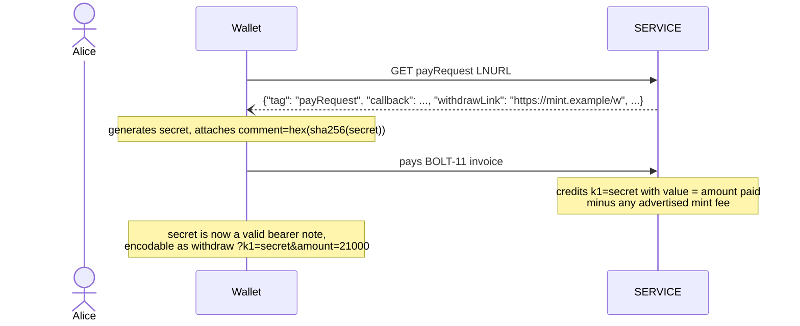
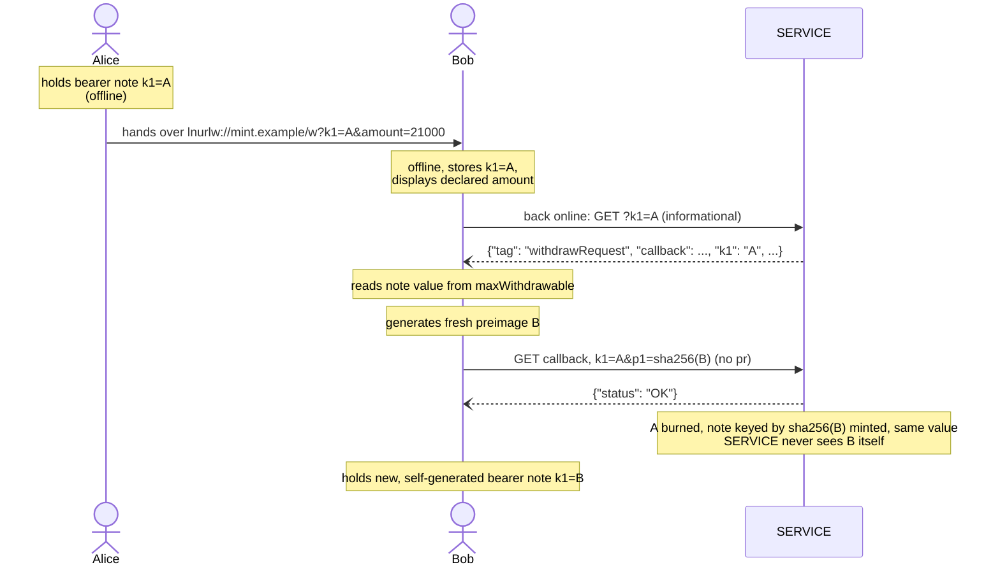
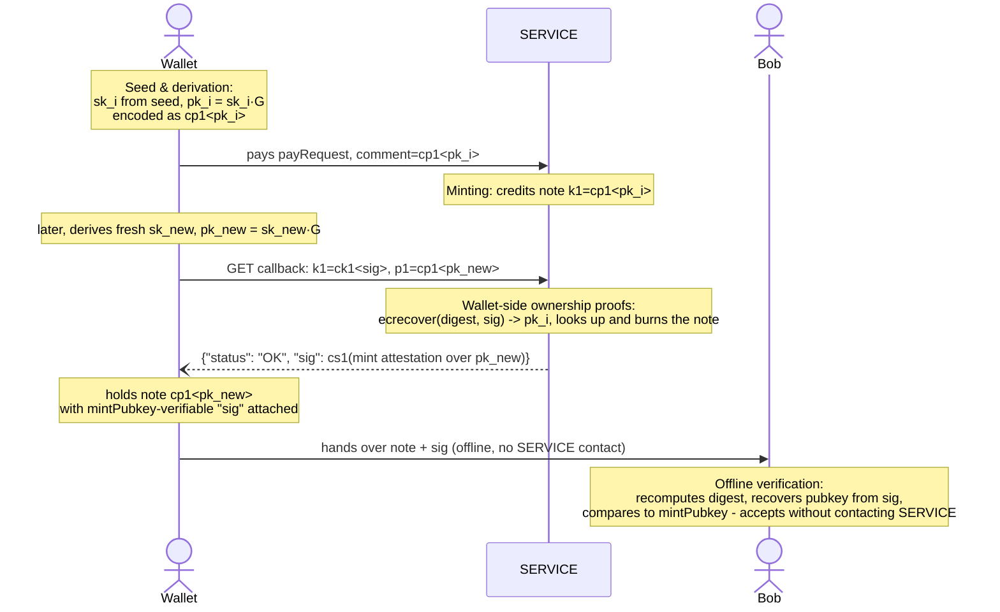

LUD-25: `LNURLcash`, Bearer assets.
====================================================

`author: dni` `status: draft`

---

## Motivation

LNURL-withdraw ([LUD-03](03.md)) links are redeemable by anyone who holds a valid `k1`. This document formalizes that property into a bearer-asset scheme: a `k1` is no longer only a one-time ticket that gets exchanged for a BOLT-11 invoice, it can *itself* be the asset. A `k1` that a `SERVICE` has credited with value can be copied, printed, NFC-tapped or handed over exactly like a banknote, and can be re-issued ("melted and re-minted"), merged with other bearer notes, or split into change.

Because a bearer `k1` is nothing more than a normal `withdrawRequest` `k1`, `LNURLcash` requires **no new endpoint and no new encoding**. A `SERVICE` that implements it is still speaking plain [LUD-03](03.md); a `WALLET` that does not know about `LNURLcash` still sees a normal withdraw link and can cash it out to a BOLT-11 invoice as usual. Redeeming a note this way is therefore fully backward-compatible. Minting one is not: it needs a `WALLET` able to attach a [LUD-12](12.md) comment (see Minting a bearer note from a payRequest).

This document is in two parts. Part 1 is the complete, minimal scheme: plain secrets, plain hashes, nothing else, and everything a `SERVICE`/`WALLET` needs to interoperate. Part 2 is optional and purely additive, but it's highly recommended regardless: offline verification and a wallet-side ownership-proof scheme, both built on recoverable ECDSA signatures.

## Part 1: Plain bearer notes

A bearer note is a `withdrawRequest` `k1`, protected by a [LUD-12](12.md) comment and a hash preimage.

### Minting a bearer note from a `payRequest`

A `payLink` ([LUD-06](06.md)) may advertise that paying it mints an `LNURLcash` bearer note, by pointing to the `withdrawRequest` endpoint:

```diff
 {
   "tag": "payRequest",
   "callback": string,
   ...
+  "metadata": "[[\"text/plain\", \"Mint fees: <base_fee_msat>,<fee_percent_ppm>\"]]",
+  "withdrawLink": string,
+  "commentAllowed": 64
 }
```

* `withdrawLink` is a raw, non bech32-encoded URL as described in [LUD-17](17.md), pointing at the `SERVICE`'s `withdrawRequest` LNURL endpoint. Appending `?k1=<preimage>&amount=<msat>` to it yields a bearer note.
* `commentAllowed` (as [LUD-12](12.md) already defines) MUST be large enough for a `payLink` to mint at all (Protecting a freshly minted note).

If the `payLink` is published as a Lightning Address ([LUD-16](16.md)) at `https://<domain>/.well-known/lnurlp/<identifier>`, a `SERVICE` MAY instead publish its withdraw LNURL at the matching `https://<domain>/.well-known/lnurlw/<identifier>` (`_` for the default identifier), the withdraw-side mirror of that same [LUD-16](16.md) convention. A `SERVICE` additionally implementing Part 2 MAY let a `WALLET` register a Lightning Address this way; see Seed & derivation.

`SERVICE` MAY additionally signal a fee it withholds on minting, so a `WALLET` can warn the payer up front that the note it ends up holding may be worth less than the invoice it just paid. It does so with an extra entry in the `metadata` array. `base_fee_msat` is a flat amount withheld from every mint, `fee_percent_ppm` is withheld on top of it in parts-per-million of the amount paid, e.g. `Mint fees: 1000,2000` means a flat 1 sat plus 0.2% of the invoice amount. A `WALLET` that recognizes the `Mint fees: ` prefix can display the expected note value before paying: `amount - base_fee_msat - amount * fee_percent_ppm / 1_000_000`. The authoritative value is only known once `secret` is claimed, though: `SERVICE` credits `k1=secret` with the amount paid minus this fee, and the `WALLET` confirms it the same way it confirms the value of any note, from `maxWithdrawable` at the informational GET (see the minting diagram). This is meant to cover whatever routing cost `SERVICE` incurs paying out this note when it is eventually melted and gives operators an incentive to run a mint. A `SERVICE` that omits this entry is assumed fee-free.



Prefixed with the `lnurlw://` scheme ([LUD-17](17.md)) or bech32-encoded as an ordinary LNURL, `<withdraw LNURL>?k1=<secret>&amount=<msat>` *is* the bearer note.

The `amount` parameter declares the note's value so that any recipient can display it without contacting `SERVICE`. At the informational LNURL endpoint it MUST be ignored by `SERVICE` (it only has meaning at the `callback`, for splits), the authoritative value is always `maxWithdrawable` from the informational GET.

### Protecting a freshly minted note

Before paying, `WALLET` generates a 32-byte `secret` and attaches `comment = hex(sha256(secret))` ([LUD-12](12.md)) to the invoice. `SERVICE` only ever learns a hash at mint time, never `secret` itself and only ever needs `secret` back later, at claim time, when `WALLET` presents it. A mint `payLink` intending to support minting at all MUST advertise a `commentAllowed` of 64, enough for a hex-encoded 32-byte hash, since without it there is no way to mint under this scheme. `SERVICE` MUST reject a mint payment carrying no `comment` with `{"status": "ERROR", "reason": string}`, before any invoice is issued.

Once the payment settles against a valid `comment = hex(h)`, `SERVICE` MUST credit an outstanding note indexed by `h`. The note is redeemable by presenting `k1=<hex(secret)>`, checked against `sha256(secret) == h`, exactly like redeeming any other `WALLET`-generated note (Redeeming a bearer note).

Nothing here needs `WALLET` to implement `LNURLcash` at all, only plain [LUD-12](12.md) comments: a holder can generate `secret`, and hand only its hash to anyone, even someone with an entirely ordinary Lightning wallet, to paste into `comment` and pay, exactly like handing them an invoice to settle on your behalf. That payer never learns `secret`, so it remains claimable only by whoever holds `secret`.

`SERVICE` SHOULD implement plain [LUD-21](21.md) `verify` on the mint `payRequest`, so `WALLET` can check when a mint or melt has settled.

### Redeeming a bearer note

Backward compatibility is achieved by keeping the callback semantics of [LUD-03](03.md) untouched for the case a `WALLET` provides a single `k1` and a `pr`. `LNURLcash` extends the callback with the remaining combinations:

| `k1` present | `pr` present | `amount` present | Result                                                             |
|--------------|--------------|-------------------|---------------------------------------------------------------------|
| one          | yes          | -                 | standard [LUD-03](03.md) melt: `k1` is burned, `pr` gets paid, to melt several notes, **merge** first |
| one          | no           | no                | **rotate**: `k1` is burned, a fresh `k1'` (`WALLET`-generated, disclosed as `p1`) of the same value is minted |
| one or many  | no           | yes               | **split**: all given `k1`s are burned, two new `WALLET`-generated notes are minted (`p1`, `p2`), one worth `amount`, one worth the remainder |
| many         | no           | -                 | **merge**: all given `k1`s are burned, one new `WALLET`-generated note (`p1`) worth their sum is minted |

These semantics apply **only to the `callback` URL** obtained from the `withdrawRequest` JSON. A GET to the bearer note's LNURL itself (the initial [LUD-03](03.md) step) is purely informational. The `k1` in that JSON response MUST be the echoed `k1` (the same value that was queried). A `WALLET` can therefore copy it directly into the `callback` request.

#### Callback request format

```
<callback>
  <?|&> k1=<k1>            // repeat for multiple k1s to merge
  [&amount=<msat>]         // only meaningful without pr, to split off change
  [&pr=<bolt11 invoice>]   // melt: pay this invoice from a single k1, as in LUD-03
  &p1=<hex sha256>         // required for rotate/split/merge: hash of a WALLET-generated preimage for the result note
  &p2=<hex sha256>         // required for split (amount present, no pr): hash of a WALLET-generated preimage for the change note
```

#### Checking a note without exposing it

`SERVICE` MUST additionally accept `?p=<hex sha256 of k1>` in place of `?k1=` on the informational GET, **and only there, never at the `callback`**. The response is the same shape [LUD-03](03.md) already defines for the informational GET with `k1` omitted.

#### Mint fee's for split and combine

If `SERVICE` advertises a mint fee, it MUST also apply the flat `base_fee_msat` to every **split** (deducted from `change`, never from the requested `amount`) and refund `(n - 1) * base_fee_msat` into the result of a **merge** of `n` notes; `fee_percent_ppm` is not reapplied to either, it was already withheld once at mint time. This stops a holder from splitting a note into many dust notes for free and melting each separately to pocket the gap between `SERVICE`'s real per-melt routing cost and the single fee it collected at mint time. If `change` would end up worth less than `base_fee_msat`, `SERVICE` MUST fail the split with `{"status": "ERROR", "reason": "insufficient value"}`.

#### URL length limits

**A merge (or a multi-`k1` split) is bounded by ordinary URL length limits, not by anything in this document.** Every repeated `k1=<k1>` costs about 68 bytes (`k1=`, 64 hex chars, `&`), and a GET request has no framing that lets it grow arbitrarily: browsers, HTTP servers, and any proxy in between commonly cap the whole URL around 2000 characters, some considerably less. That leaves room for on the order of 20-30 notes in one merge before something in the chain truncates the request, silently turning a large merge into a malformed one rather than a clean error. A `WALLET` holding more notes than that from one `SERVICE` SHOULD merge them in batches, folding the result of one merge into the next, rather than attempting all of them in a single request; `SERVICE` MAY also reject an oversized request outright with `{"status": "ERROR", "reason": "too many k1"}` rather than let it be silently mangled upstream.

#### Mutating requests

For a rotate, split or merge, the `WALLET` generates the new note's secret: it generates a 32-byte preimage and discloses only its hash, as `p1` (and, for a split's second output, `p2`). `SERVICE` registers the new note keyed by that hash directly. At no point does `SERVICE` see, generate, or need the raw preimage. `p1` MUST be present on every request that lacks `pr`, and `p2` MUST additionally be present whenever `amount` is (a split); `SERVICE` MUST reject a request missing a required hash with `{"status": "ERROR", "reason": string}` (or `"missing p2"`).

The callback response is the plain [LUD-03](03.md) success response: `{"status": "OK"}`. As with any `withdrawRequest`, an invalid, already-spent, or unknown `k1` MUST yield `{"status": "ERROR", "reason": string}`, unless it's a retry of a mutation `SERVICE` already completed (Retrying a mutation); if *any* `k1` in a multi-`k1` request is invalid, the whole request MUST fail and no note may be burned or minted.

As in plain [LUD-03](03.md), a melt's `pr` is paid out asynchronously after `{"status": "OK"}` is returned, so `SERVICE` MUST NOT burn a melted `k1` until that outgoing payment actually settles. In the meantime every `k1` involved MUST be marked pending: `SERVICE` MUST reject any other callback request naming a pending `k1` (another melt, a rotate, a split, a merge, whether against the same `k1` or combining it with others) with `{"status": "ERROR", "reason": "pending"}`. Once the outgoing payment settles, `SERVICE` finalizes the burn as normal; if it fails, `SERVICE` MUST clear the pending mark and restore the `k1`(s) to outstanding exactly as before the attempt.

`SERVICE` MUST track the set of outstanding bearer notes (`k1` → value) it has minted, the same way it tracks any other unredeemed `withdrawRequest`, including which are currently pending. Minting, rotating, merging and splitting only ever change which `k1`s are outstanding and for how much.

A burn is permanent: once a `k1` is burned, `SERVICE` MUST NOT return it to the outstanding set, credit it with new value, or reissue it. The only exceptions are restoring a pending `k1` whose melt failed to settle, which never left the set, and answering a retried rotate/split/merge (Retrying a mutation).

#### Retrying a mutation

**A retried rotate, split or merge MUST be answered as a replay, not an error.** A GET gets retried by transports that never ask `WALLET`'s permission first: an HTTP client's own timeout-retry logic, a proxy in between, a flaky connection resending the request it never saw a reply for. A rotate/split/merge is exactly the kind of GET that mutates state once and only ever wants to say so once, so `SERVICE` MUST recognize when it's being asked about a burn it already performed rather than treating the now-burned `k1` as an ordinary already-spent one. Concretely: if the `k1`(s), `p1`, `p2` and `amount` of an incoming request exactly match those of a burn `SERVICE` already completed, `SERVICE` MUST return the same success response it returned the first time (bare `{"status": "OK"}`, or extended with `sig`/`sig2` if Part 2 applies), not `{"status": "ERROR", "reason": "already spent"}`. A request that repeats the `k1`(s) but disagrees with the recorded burn on `p1`, `p2`, or `amount` is a genuine conflict, not a replay, and still gets the plain already-spent error. Without this rule, a rotate/split/merge whose response is lost in transit is indistinguishable, to both `WALLET` and `SERVICE`, from an attempt to reuse an already-spent note.

### Offline circulation

Because a bearer note is self-contained (it needs nothing beyond the `k1` string and, implicitly, the callback URL/host encoded alongside it), holders can exchange notes directly, with no connectivity to `SERVICE` at the time of the exchange. The receiving `WALLET` only needs to reach `SERVICE` once it is back online, at which point it should immediately rotate (or merge, if it already holds other notes from the same `SERVICE`) the received `k1`s into fresh ones it alone knows, closing the window in which the previous holder could also attempt to redeem them.



A `WALLET` that does not implement `LNURLcash` handles a received note exactly as Motivation already describes: an ordinary withdraw link, redeemed to a `pr` of its choosing.

> [!WARNING]
> **Accepting a plain Part 1 note while offline is a leap of faith, with no fix available within Part 1 itself.** All Bob has before reconnecting is `k1` and the `amount` Alice's note declares. Nothing in the bare `(k1, amount)` pair lets Bob check, while still offline, whether the note was ever minted at all, by which `SERVICE` or for how much: a fabricated `k1` paired with an inflated `amount` is indistinguishable from a genuine note until someone actually queries `SERVICE`. That check only happens once Bob is back online (the callback GET above), by which point a bad note has already changed hands, possibly several times. Offline verification (Part 2) closes exactly this gap.

## Part 2: Recoverable signatures (offline verification and receiving)

Everything in this part is optional and purely additive: a `SERVICE` or `WALLET` that only implements Part 1 continues to interoperate exactly as described there, unaffected. Every mechanism below is built on the same primitive, a recoverable ECDSA signature obtained the same way [LUD-13](13.md) already relies on a Lightning node's own `signmessage` API, requiring no separate key management beyond what minting/melting already needs.

The four subsections below (Encoding, Wallet-side ownership proofs, Offline verification, Seed & derivation) are easiest to read once seen as one continuous path, from a `WALLET`'s seed down to a third party verifying a note it was just handed:



### Encoding

Every value introduced in this part is encoded as [BIP-350](https://github.com/bitcoin/bips/blob/master/bip-0350.mediawiki) bech32m, under a distinct human-readable part per type. `ck1`, `cs1`, and `cx1` all exceed the 90-character total length [BIP-173](https://github.com/bitcoin/bips/blob/master/bip-0173.mediawiki) specifies for segwit addresses; that limit is not adopted here, the same departure BOLT-11 invoices already make from the same base encoding.

* `cp1<...>`: a 32-byte x-only secp256k1 public key ([BIP-340](https://github.com/bitcoin/bips/blob/master/bip-0340.mediawiki)). 2-char HRP (`cp`) + 1-char separator + 52 data symbols (256 bits) + 6-char checksum = 61 characters, comfortably under the 64 `commentAllowed` already requires, so a `cp1` value fits in a [LUD-12](12.md) `comment` unchanged.
* `ck1<...>`: a 65-byte recoverable ECDSA signature (`r ‖ s ‖ recovery-id`), produced by `WALLET` with the note's own `sk` over a fixed message . This is the actual bearer secret for a `cp1` note: showing or submitting it is what showing or submitting a plain `k1` did for a Part 1 secret. There is only ever the one `ck1` per note, the same value whether it's submitted to redeem or shown to prove authenticity. 2-char HRP (`ck`) + 1-char separator + 104 data symbols (520 bits, divides evenly) + 6-char checksum = 113 characters total. A merge combining `ck1`-bearing notes fits proportionally fewer per request than the ~68-byte-per-legacy-`k1` estimate in Redeeming a bearer note: budget roughly 12-17 such notes per merge under a 2000-character URL, rather than 20-30.
* `cs1<...>`: the same 65-byte recoverable-ECDSA shape, produced by `SERVICE` instead: its attestation that a given `cp1` note was issued for a given amount (Offline verification). Unlike `ck1`, it never grants control of anything, it's purely an issuance certificate a holder can show alongside `ck1`; on its own it authorizes nothing. 2-char HRP (`cs`) + 1-char separator + 104 data symbols + 6-char checksum = 113 characters. Carried as the `sig`/`sig2` fields of a `withdrawSuccessResponse`, and as the `sig` parameter on a verifiable note URL.
* `cx1<...>`: a 64-byte export of the safe-to-share derivation branch (Seed & derivation): the branch's public key `P` (32 bytes) concatenated with its chain code (32 bytes), nothing more. 2-char HRP (`cx`) + 1-char separator + 103 data symbols (512 bits) + 6-char checksum = 112 characters. Unlike `cp1`/`ck1`/`cs1`, this value never appears in a mint interaction.

### Wallet-side ownership proofs

A `SERVICE`/`WALLET` pair implementing this section replaces the hash-preimage commitment with a keypair: `WALLET` generates a private key `sk` and its public key `pk = sk·G`, and discloses only `pk`, encoded as `cp1<pk>`, wherever Part 1 would have disclosed `hex(sha256(secret))`.

* **Minting.** `comment = cp1<pk>` in place of `hex(sha256(secret))`; `SERVICE` credits the note as `k1 = cp1<pk>`.
* **Rotate/split/merge output.** `p1` (and `p2`) carry `cp1<pk_new>` in place of a hash.
* **Redemption.** Instead of revealing `sk`, `WALLET` submits `k1 = ck1<sig>`, the same bearer secret described in Encoding, not something computed fresh per request. `SERVICE` recovers the signer's public key with `ecrecover(digest, sig)`, takes its x-coordinate, and looks that up against its own outstanding-notes table, the same lookup it already does for a plain hex `k1`.
* **Mixed-mode merges are unrestricted.** `SERVICE` distinguishes a `cp1`/`ck1` note from a legacy one purely by prefix on each `k1` it receives, a plain hex `k1` remains self-authorizing by revelation exactly as in Part 1, a `cp1`-identified note requires a `ck1` elsewhere in the request that recovers to it. One merge request may freely combine both kinds.

### Offline verification

A `cp1` note is otherwise just a public key: nothing stops anyone from claiming it was issued by a given `SERVICE` for a given amount, and an offline recipient has no way to check. `SERVICE` MUST make its `cp1` notes offline-verifiable by signing them. This mechanism applies only to `cp1` notes: a Part 1 plain-secret note has no public commitment to attest to without disclosing the secret itself, so it stays online-only.

`SERVICE` publishes its signing key as `mintPubkey` (33-byte compressed secp256k1 public key, hex) in its `withdrawRequest` JSON response. It SHOULD be the node id `SERVICE` signs its BOLT-11 invoices with (see below for how `SERVICE` produces `cs1`), so that freshly minted and rotated notes verify against the same identity. `WALLET` paying the invoice already decodes it to pay it, and can recover `SERVICE`'s node id directly from the invoice's own recoverable signature, `mintPubkey` only needs publishing where there is no invoice to recover it from, i.e. at the withdraw LNURL (Minting a bearer note from a payRequest), whose discovery response and per-note informational GETs both carry it. The per-note informational GET on a `cp1` note additionally includes a ready-made certificate for it, as a convenience: `WALLET` should not need to force a rotate just to obtain one.

```diff
 {
   "tag": "withdrawRequest",
   ...
+  "mintPubkey": string // 33-byte compressed secp256k1 pubkey, hex
+  "sig": string        // cp1 notes only: cs1<...>, mint attestation for this note's current amount
 }
```

A rotate, split or merge additionally delivers a fresh certificate in its `withdrawSuccessResponse`, since the note it produces doesn't exist to query until the mutation completes.

A verifiable note is the pair `(ck1<...>, cs1<...>)` alongside its `amount_msat`: `ck1` is the same bearer secret as always (Encoding), `cs1` is `SERVICE`'s attestation, produced the same way [LUD-13](13.md) signs its auth seed phrase: a recoverable ECDSA signature with deterministic ([RFC6979](https://www.rfc-editor.org/rfc/rfc6979)) nonces, over

```
message = "LNURLcash:" || string(amount_msat) || ":" || hex(pk)
digest  = sha256(sha256("Lightning Signed Message:" || message))
```

`hex(pk)` is the raw 32-byte key that `p1` (or `p2`) carries as `cp1<pk>` on the redeem callback; `SERVICE` decodes it and signs over the raw key directly. `amount_msat` is its minimal base-10 form: no leading zeros, no sign, digits only. A verifier reconstructing `message` from a non-canonical `amount` just recovers a different, non-matching key.

A Lightning node's own `signmessage` API already applies internally (per [LUD-13](13.md)); `SERVICE` MAY obtain the raw signature via that same call against its own node, then reorder its 65 bytes from `signmessage`'s recovery-id-leading convention into `r ‖ s ‖ recovery-id`, the same trailing-recovery-id layout raw BOLT-11 signatures already use elsewhere in this document, before encoding it as `cs1<...>` (Encoding).

`ck1` is produced by `WALLET` the same way, with the note's own `sk`, over a fixed message that doesn't depend on `pk` or `amount` at all:

```
message = "LNURLcash"
digest  = sha256(sha256("Lightning Signed Message:" || message))
```

`WALLET` computes this once per key and reuses the exact same value everywhere `ck1` is needed, redemption included (Wallet-side ownership proofs).

To verify offline, a `WALLET` (or any recipient) first recovers `pk` from `ck1`. It then recomputes `cs1`'s message using that recovered `pk` and the URL's declared `amount`, and recovers a second key from `cs1`, comparing it to the `mintPubkey` it has on record for that mint. A match on both proves the note was issued by that mint for that amount.

The `withdrawSuccessResponse` is extended:

```diff
 {
   "status": "OK",
+  "sig": string,   // cs1<...>, recoverable signature over p1's pubkey, for the new note
+  "sig2": string   // cs1<...>, recoverable signature over p2's pubkey; present if p2 was supplied
 }
```

A verifiable note travels as the ordinary note URL, `k1` carrying `ck1` and one extra query parameter carrying `cs1`:

```
lnurlw://mint.example/w?k1=ck1<...>&amount=<msat>&sig=cs1<...>
```

> [!WARNING]
> **What this does and does not prove.** `SERVICE` never cares who submits a `ck1` (Encoding), only that it recovers to a note still outstanding. What `cs1` adds is a check the *recipient* can make before accepting a transfer: that the note really was issued by this mint, for this amount, rather than fabricated. It proves issuance, not that the note is still outstanding. Once accepted, the new holder should rotate immediately, for the same reason Offline circulation already recommends it for Part 1 notes; the only definitive settlement is an online rotate.

### Seed & derivation

`WALLET` SHOULD derive keys deterministically. The branch root for a given `SERVICE` is derived hardened, reusing the exact domain-hashing steps [LUD-05](05.md) already defines for its `linkingKey`, under a separate purpose so the two never share key material:

```
cashHashingKey   = derive(masterKey, m/139'/0)                      // LUD-05's step 1, own purpose
domainMaterial   = hmacSha256(cashHashingKey, full SERVICE domain)   // LUD-05's steps 2-3, unchanged
(d1, d2, d3, d4) = first 16 bytes of domainMaterial as 4 uint32      // exactly as LUD-05
p, chaincode     = derive(masterKey, m/139'/d1/d2/d3/d4)             // this SERVICE's branch root, hardened
P                = p·G
```

Individual note keys are then derived from that branch root *non-hardened*, the same way [BIP-341](https://github.com/bitcoin/bips/blob/master/bip-0341.mediawiki) tweaks a taproot output key, since both operate on 32-byte x-only points and need the same parity handling:

```
t     = tagged_hash("LNURLcash/derive", P || chaincode || i)
Q     = lift_x(P) + t·G
pk_i  = x(Q)                          // cp1<pk_i>, computable from (P, chaincode) alone
sk_i  = p + t          (mod n)        if P has even y
sk_i  = (n - p) + t    (mod n)        otherwise
```

`i` is a per-`SERVICE` counter `WALLET` increments once per key it derives, a mint's key or a rotate/split/merge's replacement key alike, since all of them are the same kind of thing.

To recover on a fresh install from seed alone, `WALLET` re-derives `pk_0, pk_1, ...` for each known `SERVICE` and, for each, GETs the withdraw LNURL with `?p=cp1<pk_i>`; a bare `pk_i` covers any note directly, minted, rotated, split or merged alike. `WALLET` stops scanning a given `SERVICE` after some gap limit of consecutive unknown indices, the same convention HD wallets already use for address recovery, and need not probe every index in between to get there: it can jump ahead and binary-search the boundary instead of walking it one by one. `SERVICE` MAY rate-limit this scan, in-band as an ordinary `{"status": "ERROR", "reason": "rate limited"}` rather than a distinct unknown-`pk_i` error, since [LUD-01](01.md) already makes HTTP status codes and headers meaningless here. `WALLET` MUST NOT count a rate-limit response as one of the gap limit's "unknown" ones, only the plain unknown-`pk_i` error does, or a throttled scan looks identical to having reached the end.

Because the index-level derivation is non-hardened, every `pk_i` is computable from `(P, chaincode)` alone. `WALLET` can therefore hand out `cx1<P || chaincode>` for a `SERVICE`'s branch, an xpub for notes (Encoding), to whichever companion device, bookkeeping tool, or point-of-sale terminal should be able to enumerate and watch `cp1_0, cp1_1, ...` and check status against `SERVICE`, without that party ever being able to derive `sk_i` or spend anything. This is safe specifically because Wallet-side ownership proofs never disclose `sk_i` to begin with.

`SERVICE` itself MAY be handed a `cx1`, not just a passive watcher: once `WALLET` registers one against a chosen `username`, `SERVICE` can publish an ordinary Lightning Address ([LUD-16](16.md)) at `https://<domain>/.well-known/lnurlp/<username>`, on the same domain as its mint, and mint automatically for every payment it receives there. Since `pk_i` is computable from `cx1` alone, `SERVICE` derives the next unused one itself and credits the note under `k1 = cp1<pk_i>`, exactly as if `WALLET` had supplied `comment = cp1<pk_i>` in person; no comment, and no `WALLET` involvement at receive time, is needed at all. `WALLET` discovers what arrived the same way it already recovers any note, by re-deriving `pk_0, pk_1, ...` and checking each (above). How `WALLET` registers a `username` and proves it owns it is a `SERVICE`-specific concern, the same as claiming any other Lightning Address username already is.

This auto-mint path is the one place `SERVICE` derives an index on its own instead of being handed a `pk` by `WALLET`, and its "next unused" is only ever a guess: `WALLET` increments `i` locally and `SERVICE` never learns a given index is taken until some request actually uses it, so the two can race. If `WALLET` has already derived `pk_i` for a rotate/split/merge it hasn't submitted yet, at the same moment a Lightning Address payment lands and `SERVICE` independently picks that same `i` as its next unused one, `SERVICE` would credit a fresh note to a `pk_i` `WALLET` also expects to install as the result of its own pending mutation. `SERVICE` MUST guard against this the same way it already must guard against any resubmitted `p1`/`p2`: before crediting `k1 = cp1<pk_i>` here, confirm that `pk_i` is not already outstanding or previously burned, and if it is, skip to the next `i` it hasn't used before rather than credit into it. Symmetrically, if `WALLET`'s rotate/split/merge later arrives naming a `p1`/`p2` `SERVICE` finds already occupied by such an auto-minted note, `SERVICE` MUST reject it with `{"status": "ERROR", "reason": "already in use"}` instead of merging, overwriting, or double-crediting; `WALLET` recovers by deriving the next `i` and retrying, exactly as it already does past any other gap.

> [!WARNING}
> The limitation that remains is structural, not protocol-level: if a device holding some `sk_i` on this branch is ever compromised by any other means (malware, bad RNG, disk theft) while `cx1` for that branch is public, every other note on the branch is retroactively compromised too, exactly as it would be for any shared non-hardened xpub. Signatures close the everyday leak; they do not make the branch immune to key compromise by other means.
