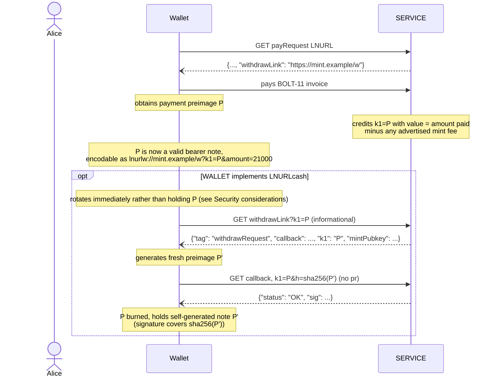
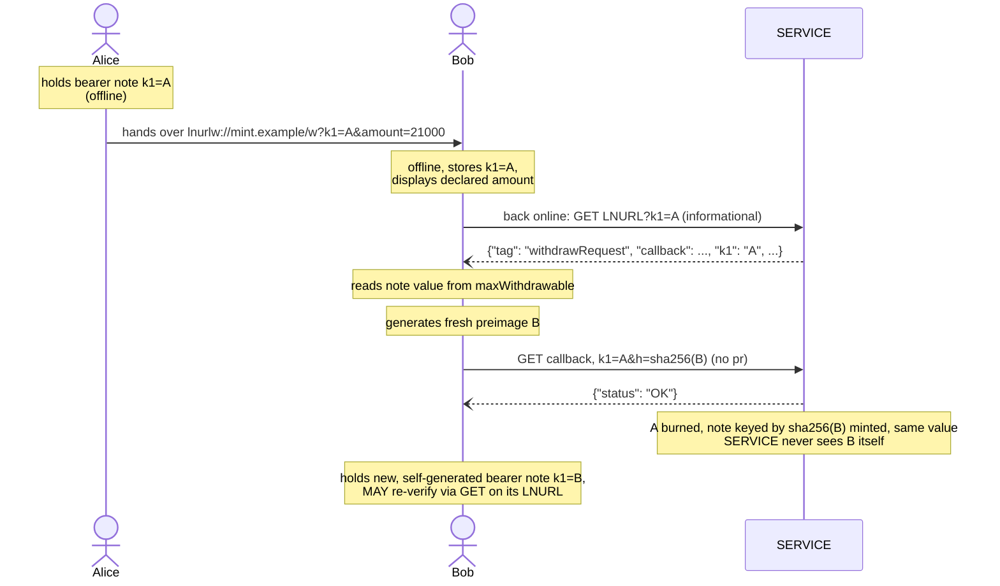

LUD-25: `LNURLcash`, Bearer assets.
====================================================

`author: dni` `status: draft`

---

## Motivation

LNURL-withdraw ([LUD-03](03.md)) links are redeemable by anyone who holds a valid `k1`. This document formalizes that property into a bearer-asset scheme: a `k1` is no longer only a one-time ticket that gets exchanged for a BOLT-11 invoice, it can *itself* be the asset. A `k1` that a `SERVICE` has credited with value can be copied, printed, NFC-tapped or handed over exactly like a banknote, and can be re-issued ("melted and re-minted"), merged with other bearer notes, or split into change, all without the holder needing to be online or to have a route back to `SERVICE` at handoff time.

Because a bearer `k1` is nothing more than a normal `withdrawRequest` `k1`, `LNURLcash` requires **no new endpoint and no new encoding**. A `SERVICE` that implements it is still speaking plain [LUD-03](03.md); a `WALLET` that does not know about `LNURLcash` still sees a normal withdraw link and can cash it out to a BOLT-11 invoice as usual. `LNURLcash` is therefore fully optional and backward-compatible.

## Minting a bearer note from a `payRequest`

A `payLink` ([LUD-06](06.md)) may advertise that paying it mints an `LNURLcash` bearer note, by pointing to the `withdrawRequest` endpoint that will recognize its own payment preimages:

```diff
 {
   "tag": "payRequest",
   "callback": string,
   "minSendable": number,
   "maxSendable": number,
   "metadata": string,
+  "withdrawLink": string
 }
```

* `withdrawLink` is a raw, non bech32-encoded URL as described in [LUD-17](17.md), pointing at the `SERVICE`'s `withdrawRequest` LNURL endpoint (the informational one, not the mutating `callback` defined below). Appending `?k1=<preimage>&amount=<msat>` to it yields a bearer note.

`SERVICE` MAY additionally signal a fee it withholds on minting, so a `WALLET` can warn the payer up front that the note it ends up holding may be worth less than the invoice it just paid. It does so with an extra `["text/plain", "Mint fees: <base_fee_msat>,<fee_percent_ppm>"]` entry in the `metadata` array. `base_fee_msat` is a flat amount withheld from every mint, `fee_percent_ppm` is withheld on top of it in parts-per-million of the amount paid, e.g. `Mint fees: 1000,2000` means a flat 1 sat plus 0.2% of the invoice amount. A `WALLET` that recognizes the `Mint fees: ` prefix can display the expected note value before paying: `amount - base_fee_msat - amount * fee_percent_ppm / 1_000_000`. The authoritative value is only known once `P` is claimed, though: `SERVICE` credits `k1=P` with the amount paid minus this fee, and the `WALLET` confirms it the same way it confirms the value of any note, from `maxWithdrawable` at the informational GET, then locks it in by rotating `P` into a fresh `k1'` of that same net value (see the minting diagram). This is meant to cover whatever routing cost `SERVICE` incurs paying out this note when it is eventually melted and gives operators an incentive to run a mint. A `SERVICE` that omits this entry is assumed fee-free.



Once payment settles, `SERVICE` MUST record `P` (the payment preimage) as an outstanding bearer note worth the amount paid, minus any advertised mint fee, and MUST accept `k1=P` at `withdrawLink` exactly as it would accept any other `withdrawRequest` `k1`. `P` requires no further encoding step: prefixed with the `lnurlw://` scheme ([LUD-17](17.md)) or bech32-encoded as an ordinary LNURL, `lnurlw://mint.example/w?k1=<P>&amount=<msat>` *is* the bearer note.

The `amount` parameter declares the note's value so that any recipient can display it without contacting `SERVICE`. At the informational LNURL endpoint it MUST be ignored by `SERVICE` (it only has meaning at the `callback`, for splits), the authoritative value is always `maxWithdrawable` from the informational GET, and only a signature (see Offline verification) makes the declared amount trustworthy offline.

A `WALLET` that does not implement `LNURLcash` simply stops here: it has paid an invoice and holds a preimage, same as any other `payRequest`. One that does SHOULD claim and rotate the note as soon as practical instead of continuing to hold `P` itself (see Security considerations).

## Redeeming a bearer note

Backward compatibility is achieved by keeping the callback semantics of [LUD-03](03.md) untouched for the case a `WALLET` provides a single `k1` and a `pr`. `LNURLcash` extends the callback with the remaining combinations:

| `k1` present | `pr` present | `amount` present | Result                                                             |
|--------------|--------------|-------------------|---------------------------------------------------------------------|
| one          | yes          | -                 | standard [LUD-03](03.md) melt: `k1` is burned, `pr` gets paid, to melt several notes, **merge** first |
| one          | no           | no                | **rotate**: `k1` is burned, a fresh `k1'` (`WALLET`-generated, disclosed as `h`) of the same value is minted |
| many         | no           | yes               | **split**: all given `k1`s are burned, two new `WALLET`-generated notes are minted (`h`, `h2`), one worth `amount`, one worth the remainder |
| many         | no           | -                 | **merge**: all given `k1`s are burned, one new `WALLET`-generated note (`h`) worth their sum is minted |

These semantics apply **only to the `callback` URL** obtained from the `withdrawRequest` JSON. A GET to the bearer note's LNURL itself (the initial [LUD-03](03.md) step) is purely informational. The `k1` in that JSON response MUST be the echoed `k1` (the same value that was queried). A `WALLET` can therefore copy it directly into the `callback` request.

If `SERVICE` advertises a mint fee, it MUST also apply the flat `base_fee_msat` to every **split** (deducted from `change`, never from the requested `amount`) and refund `(n - 1) * base_fee_msat` into the result of a **merge** of `n` notes; `fee_percent_ppm` is not reapplied to either, it was already withheld once at mint time. This stops a holder from splitting a note into many dust notes for free and melting each separately to pocket the gap between `SERVICE`'s real per-melt routing cost and the single fee it collected at mint time. If `change` would end up worth less than `base_fee_msat`, `SERVICE` MUST fail the split with `{"status": "ERROR", "reason": "insufficient value"}`.

Callback request format:

```
<callback>
  <?|&> k1=<k1>            // repeat for multiple k1s to merge
  [&amount=<msat>]         // only meaningful with a single k1 and no pr, to split off change
  [&pr=<bolt11 invoice>]   // melt: pay this invoice from a single k1, as in LUD-03
  &h=<hex sha256>          // required for rotate/split/merge: hash of a WALLET-generated preimage for the result note
  &h2=<hex sha256>         // required for split (amount present, no pr): hash of a WALLET-generated preimage for the change note
```

For a rotate, split or merge, `WALLET`, not `SERVICE`, generates the new note's secret: it picks a fresh random preimage and discloses only its hash, as `h` (and, for a split's second output, `h2`). `SERVICE` registers the new note keyed by that hash directly, the same `sha256(k1)` it would otherwise have had to compute itself per Security considerations, and, if it signs notes, produces `sig`/`sig2` over that hash (see Offline verification). At no point does `SERVICE` see, generate, or need the raw preimage; it MUST NOT persist anything beyond the hash it was given. `h` MUST be present on every request that lacks `pr`, and `h2` MUST additionally be present whenever `amount` is (a split); `SERVICE` MUST reject a request missing a required hash with `{"status": "ERROR", "reason": "missing h"}` (or `"missing h2"`) rather than generating a secret on `WALLET`'s behalf. This is what actually closes the prior-holder exposure Security considerations warns about: a rotation is only a real fix if the rotation itself doesn't hand the new secret back through `SERVICE` again, so `SERVICE` is never given the option to.

The callback response is the [LUD-03](03.md) success response: `{"status": "OK"}`. Because the new note's secret is `WALLET`-generated, `SERVICE` has nothing further to return for it: unlike the plain [LUD-03](03.md) melt response, a successful rotate/split/merge carries no `k1`. If `SERVICE` implements Offline verification, the same response additionally carries `sig` (and `sig2` for a split), its attestation over `h` (and `h2`); see below. As with any `withdrawRequest`, an invalid, already-spent, or unknown `k1` MUST yield `{"status": "ERROR", "reason": string}`; if *any* `k1` in a multi-`k1` request is invalid, or `h`/`h2` is missing or malformed, the whole request MUST fail and no note may be burned or minted.

As in plain [LUD-03](03.md), a melt's `pr` is paid out asynchronously after `{"status": "OK"}` is returned, so `SERVICE` MUST NOT burn a melted `k1` until that outgoing payment actually settles. In the meantime every `k1` involved MUST be marked pending: `SERVICE` MUST reject any other callback request naming a pending `k1` (another melt, a rotate, a split, a merge, whether against the same `k1` or combining it with others) with `{"status": "ERROR", "reason": "pending"}`. Once the outgoing payment settles, `SERVICE` finalizes the burn as normal; if it fails, `SERVICE` MUST clear the pending mark and restore the `k1`(s) to outstanding exactly as before the attempt.

`SERVICE` MUST track the set of outstanding bearer notes (`k1` → value) it has minted, the same way it tracks any other unredeemed `withdrawRequest`, including which are currently pending. Minting, rotating, merging and splitting only ever change which `k1`s are outstanding and for how much.

## Offline circulation

Because a bearer note is self-contained (it needs nothing beyond the `k1` string and, implicitly, the callback URL/host encoded alongside it), holders can exchange notes directly, with no connectivity to `SERVICE` at the time of the exchange. The receiving `WALLET` only needs to reach `SERVICE` once it is back online, at which point it should immediately rotate (or merge, if it already holds other notes from the same `SERVICE`) the received `k1`s into fresh ones it alone knows, closing the window in which the previous holder could also attempt to redeem them.



A `WALLET` that does not implement `LNURLcash` treats a received note as any other LNURL-withdraw link and redeems it to a `pr` of its choosing. This burns the note in the ordinary way and is indistinguishable, from `SERVICE`'s point of view, from any other withdrawal.

**Without offline verification, accepting a note while offline is a leap of faith.** All Bob has before reconnecting is `k1` and the `amount` Alice's note declares. Nothing in the bare `(k1, amount)` pair lets Bob check, while still offline, whether the note was ever minted at all, by which `SERVICE` or for how much: a fabricated `k1` paired with an inflated `amount` is indistinguishable from a genuine note until someone actually queries `SERVICE`. That check only happens once Bob is back online (the callback GET above), by which point a bad note has already changed hands, possibly several times. A `sig` obtained through the Offline verification mechanism below closes exactly this gap: it lets Bob confirm issuer and amount against `mintPubkey` on the spot, offline, before deciding whether to accept the note at all.

## Offline verification (optional)

A bearer note as defined above is an opaque secret: an offline recipient has no way to tell whether it was ever issued, by whom, or for how much. `SERVICE` MAY make its notes offline-verifiable by signing them.

`SERVICE` publishes its signing key as `mintPubkey` (33-byte compressed secp256k1 public key, hex) in its `withdrawRequest` JSON response. It is RECOMMENDED that this be the node id `SERVICE` signs its BOLT-11 invoices with, so that freshly minted and rotated notes verify against the same identity - obtained the same way [LUD-13](13.md) already relies on a Lightning node's own `signmessage` API rather than a separate keypair, `SERVICE` MAY sign notes with that same call against its own node, needing no key management beyond what minting/melting already require. r`WALLET` paying the invoice already decodes it to pay it, and can recover `SERVICE`'s node id directly from the invoice's own recoverable signature (see below), `mintPubkey` only needs publishing where there is no invoice to recover it from, i.e. at the withdraw endpoint used for rotated, split and merged notes.

```diff
 {
   "tag": "withdrawRequest",
   ...
+  "mintPubkey": string // 33-byte compressed secp256k1 pubkey, hex
 }
```

Signatures are only ever delivered in the `withdrawSuccessResponse` of a rotate, split or merge, the informational endpoint never returns one. A `WALLET` that wants a mint-signed certificate for a note that lacks one (e.g. a freshly minted note, or one received from a third party) obtains it by rotating the note once (see the minting diagram).

A verifiable note is the tuple `(k1, amount_msat, sig)`, signed the same way [LUD-13](13.md) signs its auth seed phrase: a recoverable ECDSA signature with deterministic ([RFC6979](https://www.rfc-editor.org/rfc/rfc6979)) nonces, over

```
message = "LNURLcash:" || amount_msat (decimal ASCII) || ":" || hex(sha256(k1))
digest  = sha256(sha256("Lightning Signed Message:" || message))
```

`hex(sha256(k1))` is exactly the `h` (or `h2`) `WALLET` supplied on the redeem callback, `SERVICE` uses it verbatim and never needs to hash a raw secret to produce this signature.

This is exactly the wrapping a Lightning node's own `signmessage` API already applies internally (per [LUD-13](13.md)); `SERVICE` MAY obtain the raw signature via that same call against its own node, then reorder its 65 bytes from `signmessage`'s recovery-id-leading convention into `r ‖ s ‖ recovery-id`, the same trailing-recovery-id layout raw BOLT-11 signatures already use elsewhere in this document, before hex-encoding it as `sig`.

To verify offline, a `WALLET` recomputes `digest` and recovers the public key from `(digest, signature)`, comparing it to the `mintPubkey` it has on record for that mint. A match proves the note was issued by that mint for that amount. Because `message` commits to `sha256(k1)` rather than the secret itself, a holder could also prove issuance publicly.

**Freshly minted notes have no signature.** A `WALLET` MUST rotate it, obtaining a `sig` made over the compact `LNURLcash` message instead.

The `withdrawSuccessResponse` is extended:

```diff
 {
   "status": "OK",
+  "sig": string,   // recoverable signature over h, for the new note
+  "sig2": string   // recoverable signature over h2; present iff h2 was supplied
 }
```

A verifiable note travels as the ordinary note URL with one extra query parameter, which legacy wallets simply ignore (the informational endpoint disregards it), and which lets an offline recipient verify the `amount` already declared in the URL:

```
lnurlw://mint.example/w?k1=<secret>&amount=<msat>&sig=<hex>
```

**What this does and does not prove.** The signature proves the note *was issued*, it can never prove the note is *still outstanding*. A spent note keeps its valid signature forever, and no revocation is visible offline. Offline verification therefore eliminates forged mints and misstated amounts, but not double-spending: accepting a note offline remains a trust decision about the person handing it over, exactly as checking a banknote for counterfeits does not prove it was not already promised to someone else. The only definitive settlement is an online rotate.

## Security considerations

`SERVICE` SHOULD store only `sha256(k1)` for each outstanding note, not the secret itself, and compare hashes at redemption, a leaked database then reveals how many notes are outstanding and for how much, but not enough to spend them.

A freshly minted note is a special case of the above: `SERVICE` generated `P` itself to fund the invoice, and the Lightning node behind it typically retains a paid invoice's preimage in its own records indefinitely, independent of whatever `SERVICE`'s own application layer discards per the hashing above. `SERVICE`'s infrastructure is therefore, structurally, a permanent prior holder of a freshly minted note's secret, in exactly the sense Offline circulation warns about for any other prior holder. A `WALLET` MUST claim and rotate a freshly minted note as soon as practical after paying, the same as it would rotate one received from someone else. This matters more, when `SERVICE` offers [LUD-21](21.md) verify: confirming settlement and rotating the note are separate steps, and verify only makes the former convenient. Deferring the rotate leaves the same exposure window open regardless of how promptly settlement was checked.

Because `h`/`h2` are mandatory on every rotate, split and merge, that rotate actually closes the exposure instead of merely relocating it: `SERVICE` never comes into possession of the new note's raw secret, so there is no second copy for it, or its Lightning node, to retain. `SERVICE` MUST NOT accept a rotate/split/merge request that omits the required hash and generate a secret in its place, doing so would silently reopen the exact prior-holder gap this mechanism exists to close. This is the last hop, once `WALLET` holds the rotated note, its secret has existed nowhere but `WALLET` itself.

Because `k1` travels directly in the URL for both the informational GET and the `callback`, it can end up in access logs, proxies, or browser history, `SERVICE` SHOULD NOT log query strings on its withdraw endpoints. `WALLET` MUST treat a note as exposed the moment it has transmitted its `k1` for any reason, including just inspecting it, and MUST rotate it at the next opportunity rather than keep circulating the same secret.
