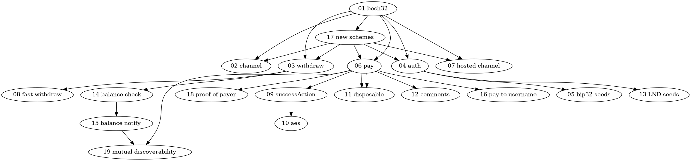

LNURL Documents
===============

These are all the individual documents describing each small piece of protocol that can be implemented under the LNURL umbrella. Different wallets and services may implement different sets of protocols.

| Number   | Description                                                 | Wallets (in alphabetical order) |
|----------|-------------------------------------------------------------|---------|
| [01][01] | Base LNURL encoding and decoding.                           | _all the ones listed below_ |
| [02][02] | `channelRequest` base spec.                                 | [Balance of Satoshis][bos], [Blixt][blixt], [Breez][breez], [cliché][cliche], [SimpleBitcoinWallet][sbw], [Zap Android][zap], [Zap Desktop][zap], [Zeus][zeus] |
| [03][03] | `withdrawRequest` base spec.                                | [Balance of Satoshis][bos], [Blixt][blixt], [BlueWallet][bluewallet], [Breez][breez], [Clams][clams], [CoinCorner][coincorner], [coinos][coinos], [Fountain][fountain], [LifPay][lifpay], [LNbits][lnbits], [LightningTipBot][ltb], [Muun][muun], [Phoenix][phoenix], [Pouch.ph][pouchph], [ShockWallet][shockwallet], [SimpleBitcoinWallet][sbw], [ThunderHub][thunderhub], [Wallet of Satoshi][wos], [Zap Android][zap], [Zap Desktop][zap], [Zap iOS][zap], [ZBD Discord][zbd], [ZBD Extension][zbd], [ZBD Telegram][zbd], [ZEBEDEE][zbd], [Zeus][zeus] |
| [04][04] | Auth base spec.                                             | [Alby][alby], [Balance of Satoshis][bos], [Blixt][blixt], [Breez][breez], [BlueWallet][bluewallet], [Clams][clams], [coinos][coinos], [Geyser][geyser], [LifPay][lifpay], [LNbits][lnbits], [LightningTipBot][ltb], [Phoenix][phoenix], [SeedAuth][seedauth], [SeedAuthExtension][sae], [SimpleBitcoinWallet][sbw], [Sparrow Wallet][sparrow], [ThunderHub][thunderhub], [Zap Desktop][zap], [Zeus][zeus] |
| [05][05] | BIP32-based seed generation for auth protocol.              | [coinos][coinos] [SimpleBitcoinWallet][sbw] |
| [06][06] | `payRequest` base spec.                                     | [Alby][alby], [Balance of Satoshis][bos], [Blixt][blixt], [BlueWallet][bluewallet], [Bottlepay][bottlepay], [Breez][breez], [BTCPayServer][btcp], [Clams][clams], [cliché][cliche], [CoinCorner][coincorner], [coinos][coinos], [Electrum][electrum], [Fountain][fountain], [Galoy][galoy], [Geyser][geyser], [LifPay][lifpay], [LNbits][lnbits], [LNLink][lnlink], [LNPay.co][lnpay], [LightningTipBot][ltb], [Machankura][machankura], [Phoenix][phoenix], [Pouch.ph][pouchph], [ShockWallet][shockwallet], [SimpleBitcoinWallet][sbw], [ThunderHub][thunderhub], [Wallet of Satoshi][wos], [Zap Android][zap], [ZBD Discord][zbd], [ZBD Extension][zbd], [ZBD Telegram][zbd], [ZEBEDEE][zbd], [Zeus][zeus] |
| [07][07] | `hostedChannelRequest` base spec.                           | [SimpleBitcoinWallet][sbw], [OpenBitcoinWallet][OBW] |
| [08][08] | Fast `withdrawRequest`.                                     | [cliché][cliche], [SimpleBitcoinWallet][sbw], [ZBD Extension][zbd] |
| [09][09] | `successAction` field for `payRequest`.                     | [Alby][alby], [Blixt][blixt], [BlueWallet][bluewallet], [Breez][breez], [Clams][clams], [cliché][cliche], [coinos][coinos], [Fountain][fountain], [LNbits][lnbits], [LightningTipBot][ltb], [Phoenix][phoenix], [ShockWallet][shockwallet], [SimpleBitcoinWallet][sbw], [ThunderHub][thunderhub], [Wallet of Satoshi][wos], [Zap Android][zap], [ZBD Discord][zbd], [ZBD Extension][zbd], [ZBD Telegram][zbd], [ZEBEDEE][zbd], [Zeus][zeus] |
| [10][10] | `aes` success action in `payRequest`.                       | [Alby][alby], [Blixt][blixt], [BlueWallet][bluewallet], [Breez][breez], [Clams][clams], [cliché][cliche], [coinos][coinos], [LNbits][lnbits], [Phoenix][phoenix], [ShockWallet][shockwallet], [SimpleBitcoinWallet][sbw], [ThunderHub][thunderhub], [Wallet of Satoshi][wos], [Zap Android][zap], [Zeus][zeus] |
| [11][11] | Disposable and storeable `payRequest`s.                     | [Blixt][blixt], [SimpleBitcoinWallet][sbw], [ZBD Extension][zbd] |
| [12][12] | Comments in `payRequest`.                                   | [Alby][alby], [Blixt][blixt], [BlueWallet][bluewallet], [Breez][breez], [Clams][clams], [Fountain][fountain], [LNbits][lnbits], [LightningTipBot][ltb], [Phoenix][phoenix], [ThunderHub][thunderhub],  [ZBD Discord][zbd], [ZBD Extension][zbd], [ZBD Telegram][zbd], [ZEBEDEE][zbd], [Zeus][zeus] |
| [13][13] | `signMessage`-based seed generation for auth protocol.      | [Alby][alby], [Balance of Satoshis][bos], [Blixt][blixt], [Clams][clams], [Zeus][zeus] |
| [14][14] | `balanceCheck`: reusable `withdrawRequest`s.                | [Alby][alby], [Blixt][blixt], [LNbits][lnbits], |
| [15][15] | `balanceNotify`: services hurrying up the withdraw process. | [LNbits][lnbits] |
| [16][16] | Paying to static internet identifiers.                      | [Alby][alby], [Balance of Satoshis][bos], [Blixt][blixt], [BTCPayServer][btcp], [Clams][clams], [cliché][cliche], [CoinCorner][coincorner], [coinos][coinos], [Fountain][fountain], [LifPay][lifpay], [LNbits][lnbits], [LNLink][lnlink], [LightningTipBot][ltb], [Machankura][machankura], [Phoenix][phoenix], [Pouch.ph][pouchph], [SimpleBitcoinWallet][sbw], [Zap Android][zap], [ZBD Discord][zbd], [ZBD Extension][zbd], [ZBD Telegram][zbd], [ZEBEDEE][zbd], [Zeus][zeus] |
| [17][17] | Scheme prefixes and raw (non bech32-encoded) URLs.          | [Alby][alby], [Blixt][blixt], [BTCPayServer][btcp], [Clams][clams], [cliché][cliche], [CoinCorner][coincorner], [ZBD Discord][zbd], [ZBD Telegram][zbd] | [Wallet of Satoshi][wos] |
| [18][18] | Payer identity in `payRequest` protocol.                    | [Blixt][blixt], [cliché][cliche], [ZBD Discord][zbd], [ZBD Telegram][zbd] |
| [19][19] | Pay link discoverable from withdraw link.                   | [Blixt][blixt], [CoinCorner][coincorner], [SimpleBitcoinWallet][sbw] |
| [20][20] | Long payment description for pay protocol.                  | [Alby][alby], [Blixt][blixt], [Clams][clams], [cliché][cliche], [Phoenix][phoenix] |
| [21][21] | Pay in local unit of account                                | [Pouch.ph][pouchph]

[alby]: https://github.com/getAlby/lightning-browser-extension
[bos]: https://github.com/alexbosworth/balanceofsatoshis
[blixt]: https://blixtwallet.github.io
[bluewallet]: https://bluewallet.io
[bottlepay]: https://bottlepay.com
[btcp]: https://btcpayserver.org
[breez]: https://breez.technology
[clams]: https://clams.tech
[cliche]: https://github.com/fiatjaf/cliche
[coincorner]: https://coincorner.com
[coinos]: https://coinos.io
[electrum]: https://electrum.org
[fountain]: https://fountain.fm
[galoy]: https://galoy.io
[geyser]: https://geyser.fund
[lifpay]: https://lifpay.me
[lnbits]: https://lnbits.com
[lnlink]: https://lnlink.app
[lnpay]: https://lnpay.co
[ltb]: https://ln.tips
[machankura]: https://8333.mobi
[muun]: https://muun.com
[OBW]: https://darthcoin.substack.com/p/obw-open-bitcoin-wallet
[phoenix]: https://phoenix.acinq.co
[pouchlite]: https://pouch.ph/lite
[pouchph]: https://pouch.ph

[sae]: https://github.com/pseudozach/seedauthextension
[sbw]: https://lightning-wallet.com
[seedauth]: https://seedauth.etleneum.com/
[shockwallet]: https://shockwallet.app
[sparrow]: https://sparrowwallet.com/
[thunderhub]: https://www.thunderhub.io
[wos]: https://www.walletofsatoshi.com
[zap]: https://zaphq.io/
[zbd]: https://zebedee.io/wallet
[zeus]: https://zeusln.app

Services
--------

| Name                                                                                                | LUDs                                                           |
| ----                                                                                                | ----                                                           |
| [Azteco](https://azte.co/)                                                                          | [01][01] [03][03]                                              |
| [BTC Origin Stories](https://btcoriginstories.com/)                                                 | [01][01] [06][06]                                              |
| [Bitcoin Bounce](https://thndr.games/)                                                              | [01][01] [03][03] [08][08]                                     |
| [Bitrefill](https://bitrefill.com/)                                                                 | [01][01] [02][02] [06][06] [16][16]                            |
| [Blocktank](https://synonym.to/blocktank/)                                                          | [01][01] [02][02]                                              |
| [Bottlepay](https://bottlepay.com/)                                                                 | [01][01] [06][06]                                              |
| [Bull Bitcoin](https://www.bullbitcoin.com/)                                                        | [01][01] [03][03]                                              |
| [CoinCorner](https://www.coincorner.com)                                                            | [01][01] [03][03] [06][06] [16][16] [17][17] [19][19]          |
| [Etleneum](https://etleneum.com/)                                                                   | [01][01] [03][03] [04][04] [06][06] [09][09] [14][14] [15][15] |
| [Fountain Podcasts](https://fountain.fm)                                                            | [01][01] [03][03] [06][06] [09][09] [12][12] [16][16]          |
| [Galoy](https://galoy.io/)                                                                          | [01][01] [06][06]   |
| [Geyser](https://geyser.fund/)                                                                      | [01][01] [04][04] [06][06]   |
| [Going Dutch](https://goingdutch.pm/)                                                               | [01][01] [03][03] [06][06]                                     |
| [HangarSix](https://www.hangarsixgaming.com/)                                                       | [01][01] [03][03]                                              |
| [IBEXHub](https://ibexmercado.gitbook.io/ibex-hub-api/reference/api-reference)                      | [01][01] [03][03] [06][06] [16][16]                            |
| [Infuse](https://zebedee.io/infuse/)                                                                | [01][01] [03][03]                                              |
| [Kollider](https://kollider.xyz/)                                                                   | [01][01] [03][03] [04][04]                                     |
| [LifPay](https://lifpay.me)                                                                   | [01][01] [03][03] [04][04] [06][06] [16][16]                              |
| [LNBIG](https://lnbig.com/)                                                                         | [01][01] [02][02]                                              |
| [ln.cash](https://ln.cash)                                                                          | [01][01] [03][03]                                              |
| [LNMarkets](https://lnmarkets.com/)                                                                 | [01][01] [03][03] [04][04] [06][06] [16][16]                   |
| [LNPay.co](https://lnpay.co)                                                                        | [01][01] [03][03] [06][06] [14][14]                            |
| [LNbits.com](https://lnbits.com/)                                                                   | [01][01] [03][03] [04][04] [14][14] [15][15]                   |
| [Lightning.Video](https://lightning.video/)                                                         | [01][01] [04][04]                                              |
| [Lightning Gifts](https://lightning.gifts/)                                                         | [01][01] [03][03] [06][06] [12][12]                            |
| [LightningTipBot](https://ln.tips/)                                                                 | [01][01] [03][03] [06][06] [09][09] [12][12] [16][16]                   |
| [Lnurl-Pay Chat](https://chat.blixtwallet.com/)                                                     | [01][01] [06][06] [11][11] [12][12] [18][18]                   |
| [Loft](https://loft.trade/)                                                                         | [01][01] [03][03] [04][04]                                     |
| [Machankura](https://8333.mobi)                                                                     | [01][01] [06][06] [16][16]                                     |
| [Microlancer](https://microlancer.io/)                                                              | [01][01] [03][03] [14][14]                                     |
| [OpenNode](https://developers.opennode.com/reference/initiate-lnurl-withdrawal)                     | [01][01] [03][03]                                              |
| [Paywall](https://paywall.link)                                                                     | [01][01] [03][03]                                              |
| [Sats4Likes](https://sats4likes.com/)                                                               | [01][01] [03][03] [14][14] [16][16]                            |
| [Satsback.com](https://satsback.com)                                                                | [01][01] [03][03] [06][06] [16][16]                            |
| [sms4sats](https://sms4sats.com/)                                                                   | [01][01] [03][03]                                              |
| [SouthXchange](https://www.southxchange.com/)                                                       | [01][01] [03][03]                                              |
| [Surfcity Parking](https://surfcity.app/)                                                           | [01][01] [03][03]                                              |
| [Wheel of Fortune](https://fortune.lngames.net)                                                     | [01][01] [03][03] [04][04]                                     |
| [bridgeaddr](https://bridgeaddr.fiatjaf.com)                                                        | [01][01] [06][06] [09][09] [12][12] [16][16]                   |
| [coinos](https://coinos.io/)                                                                        | [01][01] [03][03] [04][04] [06][06] [16][16]                   |
| [lnshort.it](https://lnshort.it/)                                                                   | [01][01] [04][04] [06][06]                                     |
| [lnsms.world](https://lnsms.world/)                                                                 | [01][01] [06][04] [11][11] [12][12] [16][16]                   |
| [lnurl-pay.me](https://lnurl-pay.me)                                                                | [01][01] [06][06] [16][16]                                     |
| [pollofeed](https://pollofeed.com)                                                                  | [01][01] [06][06] [16][16]                                     |
| [stacker.news](https://stacker.news/)                                                               | [01][01] [03][03] [04][04] [06][06] [16][16]                   |
| [zbd.gg](https://zbd.gg/)                                                                           | [01][01] [03][03] [06][06] [09][09] [12][12] [16][16]          |
| [lnurlpay.com](https://lnurlpay.com/)                                                               | [01][01] [06][06] [12][12] [16][16]                            |
| [zero fee routing](https://zerofeerouting.com/mobile-wallets/)                                      | [01][01] [02][02]                                              |
| [strike.army](https://strike.army/)                                                                 | [01][01] [03][03] [06][06] [12][12] [16][16]                   |

[rtb]: https://play.google.com/store/apps/details?id=com.pseudozach.rewardstobitcoin

Self-hosted
-----------

| Name                                                                                       | LUDs                                         |
| ----                                                                                       | ----                                         |
| [Addressless](https://github.com/futurepaul/addressless)                                   | [01][01] [06][06] [09][09] [16][16]          |
| [Bleskomat](https://github.com/samotari/bleskomat)                                         | [01][01] [03][03]                            |
| [BTCPayServer](https://btcpayserver.org/)                                                  | [01][01] [06][06] [16][16] [17][17]          |
| [Citadel Bitcoin Node](https://github.com/runcitadel)                                      | [01][01] [06][06] [16][16]                   |
| [Cypherapp](https://github.com/SatoshiPortal/lnurl_cypherapp)                              | [01][01] [03][03]                            |
| [LNURL Daemon](https://github.com/yanascz/lnurld)                                          | [01][01] [06][06] [09][09] [12][12] [16][16] |
| [LNURLPoS](https://github.com/arcbtc/LNURLPoS)                                             | [01][01] [06][06] [09][09]                   |
| [LNURLp](https://github.com/lnbits/lnbits/tree/master/lnbits/extensions/lnurlp)            | [01][01] [06][06] [12][12]                   |
| [LNURLw](https://github.com/lnbits/lnbits/tree/master/lnbits/extensions/withdraw)          | [01][01] [03][03]                            |
| [LNbits.com](https://github.com/fiatjaf/lnbits)                                            | [01][01] [03][03] [04][04] [14][14] [15][15] |
| [LightningATM](https://github.com/21isenough/LightningATM)                                 | [01][01] [03][03]                            |
| [NextPay](https://github.com/apotdevin/NextPay)                                            | [01][01] [06][06] [16][16]                   |
| [OfflineShop](https://github.com/lnbits/lnbits/tree/master/lnbits/extensions/offlineshop)  | [01][01] [06][06] [09][09]                   |
| [Satdress](https://github.com/fiatjaf/satdress)                                            | [01][01] [06][06] [09][09] [16][16]          |
| [Streamer Copilot](https://github.com/lnbits/lnbits/tree/master/lnbits/extensions/copilot) | [01][01] [06][06] [12][12]                   |
| [go-host-lnaddr](https://github.com/hieblmi/go-host-lnaddr)                                | [01][01] [06][06] [09][09] [16][16]          |
| [ligess](https://github.com/Dolu89/ligess/)                                                | [01][01] [06][06] [09][09] [16][16]          |
| [lnme](https://github.com/bumi/lnme)                                                       | [01][01] [06][06] [09][09] [16][16]          |

Libraries
---------

| Name                                                  | LUDs                                                                                                                                                     |
| ----                                                  | ----                                                                                                                                                     |
| [IMMORTAN](https://github.com/fiatjaf/IMMORTAN)       | [01][01] [02][02] [03][03] [04][04] [05][05] [06][06] [07][07] [08][08] [09][09] [10][10] [11][11] [12][12] [16][16] [17][17] [18][18] [20][20]          |
| [LNURL C#](https://github.com/Kukks/LNURL)            | [01][01] [02][02] [03][03] [04][04] [06][06] [07][07] [08][08] [09][09] [10][10] [11][11] [12][12] [14][14] [15][15] [16][16] [17][17] [18][18] [19][19] |
| [dart-lnurl](https://github.com/saentari/dart_lnurl)  | [01][01] [02][02] [03][03] [04][04] [05][05] [06][06] [09][09] [10][10] [11][11] [12][12] [14][14] [17][17] [18][18] [19][19]                            |
| [go-lnurl](https://github.com/fiatjaf/go-lnurl)       | [01][01] [02][02] [03][03] [04][04] [06][06] [08][08] [09][09] [10][10] [11][11] [12][12] [14][14] [16][16] [18][18] [20][20]                            |
| [js-lnurl](https://github.com/fiatjaf/js-lnurl)       | [01][01] [02][02] [03][03] [04][04] [06][06] [08][08] [09][09] [10][10] [11][11] [12][12]                                                                |
| [lnurl-node](https://github.com/chill117/lnurl-node)  | [01][01] [02][02] [03][03] [04][04] [06][06] [08][08] [09][09] [10][10] [11][11] [12][12]                                                                |
| [lnurl-platformio][platformio]                        | [01][01] [03][03]                                                                                                                                        |
| [lnurl-ruby](https://github.com/bumi/lnurl-ruby)      | [01][01] [06][06] [09][09]                                                                                                                               |
| [lnurlauth](https://github.com/xplorfin/lnurlauth)    | [01][01] [04][04]                                                                                                                                        |
| [php-lnurl](https://github.com/tkijewski/php-lnurl)   | [01][01]                                                                                                                                                 |
| [python-lnurl](https://github.com/python-ln/lnurl)    | [01][01] [02][02] [03][03] [04][04] [06][06]                                                                                                             |
| [bitcoin-s](https://github.com/bitcoin-s/bitcoin-s)   | [01][01] [03][03] [06][06] [09][09]                                                                                                                      |
| [lnurl-rs][lnurl-rs]                                  | [01][01] [03][03] [06][06]                                                                                                                               |
| [rust-lnurl][rust-lnurl]                              | [01][01] [03][03] [04][04]                                                                                                                               |
| [spring-lnurl][springlnurl]                           | [01][01] [04][04]                                                                                                                                        |
| [lnurl_client-ex][lnurl_client-ex]                    | [01][01] [06][06]                                                                                                                                        |

[rust-lnurl]: https://github.com/edouardparis/rust-lnurl
[lnurl-rs]: https://github.com/benthecarman/lnurl-rs
[platformio]: https://github.com/chill117/lnurl-platformio
[springlnurl]: https://github.com/theborakompanioni/bitcoin-spring-boot-starter#spring-lnurl
[lnurl_client-ex]: https://github.com/ramontayag/lnurl_client-ex

Tools for developers
--------------------

| Name                                                                   | LUDs                                                                                                        |
| ----                                                                   | ----                                                                                                        |
| [LNURLProxyAPI](https://github.com/21isenough/LNURLProxyAPI)           | [01][01] [03][03]                                                                                           |
| [Lightning Decoder](https://lightningdecoder.com/)                     | [01][01] [02][02] [03][03] [04][04] [06][06] [16][16]                                                       |
| [Lightning Login](https://lightninglogin.live/)                        | [01][01] [04][04]                                                                                           |
| [bifrost](https://github.com/takinbo/bifrost)                          | [01][01] [02][02]                                                                                           |
| [lnch-vekslak](https://github.com/Kixunil/lnch-vekslak)                | [01][01] [02][02]                                                                                           |
| [lnurl codec JS](https://lnurl.fiatjaf.com/codec)                      | [01][01]                                                                                                    |
| [lnurl codec Scala](https://j-chimienti.github.io/lnurl_codec/)        | [01][01]                                                                                                    |
| [lnurl playground](https://lnurl.fiatjaf.com)                          | [01][01] [02][02] [03][03] [04][04] [06][06] [09][09] [10][10] [12][12] [14][14] [15][15] [18][18] [20][20] |
| [lnurl-toolbox](https://lnurl-toolbox.degreesofzero.com/)              | [01][01] [02][02] [03][03] [04][04] [06][06]                                                                |
| [passport-lnurl-auth](https://github.com/chill117/passport-lnurl-auth) | [01][01] [04][04]                                                                                           |
| [Zerologin](https://github.com/zerologin/zerologin)                    | [01][01] [04][04]                                                                                           |

[01]: 01.md
[02]: 02.md
[03]: 03.md
[04]: 04.md
[05]: 05.md
[06]: 06.md
[07]: 07.md
[08]: 08.md
[09]: 09.md
[10]: 10.md
[11]: 11.md
[12]: 12.md
[13]: 13.md
[14]: 14.md
[15]: 15.md
[16]: 16.md
[17]: 17.md
[18]: 18.md
[19]: 19.md
[20]: 20.md
[21]: 21.md

Dependency Tree
---------------

The entire idea of the suite of LNURL protocols is that they are optional. Each new LUD may be implemented by some wallets and not others, some services and not others, but they should still maintain compatibility at all times (except, of course, if the service _requires_ the new functionality).

There is also a hierarchy of internal dependencies between the LUDs -- for example, you cannot implement sending comments in `payRequest`s if you haven't implemented the base `payRequest` spec also. The following graph displays that hierarchy of internal dependencies (you can safely ignore it though).

How to add your own document
----------------------------

Open a pull request with your proposal. Pick the next unreserved number for your proposal. To be accepted, it just has to be generally decent and make sense and be implemented or currently being implemented by 2 or more wallets.

Join https://t.me/lnurl if you just want to talk about your ideas or chat about LNURL protocols in general.
