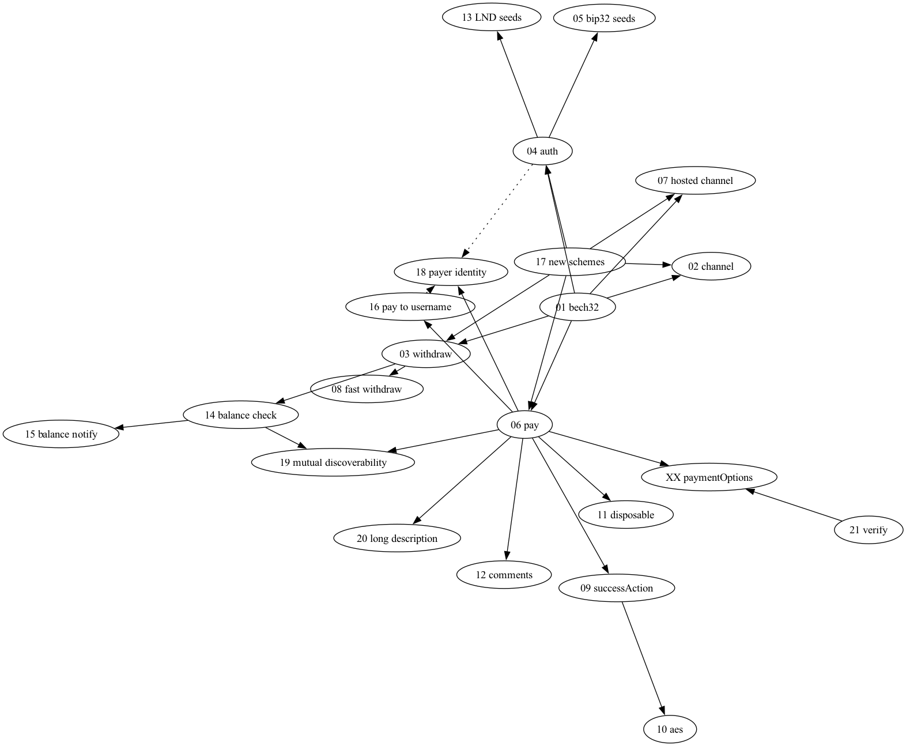

LNURL Documents
===============

These are all the individual documents describing each small piece of protocol that can be implemented under the LNURL umbrella. Different wallets and services may implement different sets of protocols.

| Number   | Description                                                 |
|----------|-------------------------------------------------------------|
| [01][01] | Base LNURL encoding and decoding.                           |
| [02][02] | `channelRequest` base spec.                                 |
| [03][03] | `withdrawRequest` base spec.                                |
| [04][04] | Auth base spec.                                             |
| [05][05] | BIP32-based seed generation for auth protocol.              |
| [06][06] | `payRequest` base spec.                                     |
| [07][07] | `hostedChannelRequest` base spec.                           |
| [08][08] | Fast `withdrawRequest`.                                     |
| [09][09] | `successAction` field for `payRequest`.                     |
| [10][10] | `aes` success action in `payRequest`.                       |
| [11][11] | Disposable and storeable `payRequest`s.                     |
| [12][12] | Comments in `payRequest`.                                   |
| [13][13] | `signMessage`-based seed generation for auth protocol.      |
| [14][14] | `balanceCheck`: reusable `withdrawRequest`s.                |
| [15][15] | `balanceNotify`: services hurrying up the withdraw process. |
| [16][16] | Paying to static internet identifiers.                      |
| [17][17] | Scheme prefixes and raw (non bech32-encoded) URLs.          |
| [18][18] | Payer identity in `payRequest` protocol.                    |
| [19][19] | Pay link discoverable from withdraw link.                   |
| [20][20] | Long payment description for pay protocol.                  |
| [21][21] | `verify` LNURL-pay payments                                 |
| [23][23] | Request user's Lightning address                            |

Self-hosted
-----------

| Name                                                                                       | LUDs                                                           |
| ----                                                                                       | ----                                                           |
| [Addressless](https://github.com/futurepaul/addressless)                                   | [01][01] [06][06] [09][09] [16][16]                            |
| [Bleskomat](https://github.com/samotari/bleskomat)                                         | [01][01] [03][03]                                              |
| [BTCPayServer](https://btcpayserver.org/)                                                  | [01][01] [06][06] [16][16] [17][17]                            |
| [Citadel Bitcoin Node](https://github.com/runcitadel)                                      | [01][01] [06][06] [16][16]                                     |
| [Cypherapp](https://github.com/SatoshiPortal/lnurl_cypherapp)                              | [01][01] [03][03]                                              |
| [LNURL Daemon](https://github.com/yanascz/lnurld)                                          | [01][01] [03][03] [04][04] [06][06] [09][09] [12][12] [16][16] |
| [LNURLPoS](https://github.com/arcbtc/LNURLPoS)                                             | [01][01] [06][06] [09][09]                                     |
| [LNURLp](https://github.com/lnbits/lnbits/tree/master/lnbits/extensions/lnurlp)            | [01][01] [06][06] [12][12]                                     |
| [LNURLw](https://github.com/lnbits/lnbits/tree/master/lnbits/extensions/withdraw)          | [01][01] [03][03]                                              |
| [LNbits.com](https://github.com/fiatjaf/lnbits)                                            | [01][01] [03][03] [04][04] [14][14] [15][15]                   |
| [LightningATM](https://github.com/21isenough/LightningATM)                                 | [01][01] [03][03]                                              |
| [NextPay](https://github.com/apotdevin/NextPay)                                            | [01][01] [06][06] [16][16]                                     |
| [OfflineShop](https://github.com/lnbits/lnbits/tree/master/lnbits/extensions/offlineshop)  | [01][01] [06][06] [09][09]                                     |
| [Satdress](https://github.com/fiatjaf/satdress)                                            | [01][01] [06][06] [09][09] [16][16]                            |
| [Streamer Copilot](https://github.com/lnbits/lnbits/tree/master/lnbits/extensions/copilot) | [01][01] [06][06] [12][12]                                     |
| [electrum-lnurl-server](https://plugins.electrum.org/plugin/lnurl-server/)                 | [06][06] [16][16]                                              |
| [go-host-lnaddr](https://github.com/hieblmi/go-host-lnaddr)                                | [01][01] [06][06] [09][09] [16][16]                            |
| [ligess](https://github.com/Dolu89/ligess/)                                                | [01][01] [06][06] [09][09] [16][16]                            |
| [lnme](https://github.com/bumi/lnme)                                                       | [01][01] [06][06] [09][09] [16][16]                            |

Libraries
---------

| Name                                                  | LUDs                                                                                                                                                     |
| ----                                                  | ----                                                                                                                                                     |
| [IMMORTAN](https://github.com/fiatjaf/IMMORTAN)       | [01][01] [02][02] [03][03] [04][04] [05][05] [06][06] [07][07] [08][08] [09][09] [10][10] [11][11] [12][12] [16][16] [17][17] [18][18] [20][20]          |
| [LNURL C#](https://github.com/Kukks/LNURL)            | [01][01] [02][02] [03][03] [04][04] [06][06] [07][07] [08][08] [09][09] [10][10] [11][11] [12][12] [14][14] [15][15] [16][16] [17][17] [18][18] [19][19] |
| [dart-lnurl](https://github.com/saentari/dart_lnurl)  | [01][01] [02][02] [03][03] [04][04] [05][05] [06][06] [09][09] [10][10] [11][11] [12][12] [14][14] [17][17] [18][18] [19][19]                            |
| [go-lnurl](https://github.com/fiatjaf/go-lnurl)       | [01][01] [02][02] [03][03] [04][04] [06][06] [08][08] [09][09] [10][10] [11][11] [12][12] [14][14] [16][16] [18][18] [20][20]                            |
| [js-lnurl](https://github.com/fiatjaf/js-lnurl)       | [01][01] [02][02] [03][03] [04][04] [06][06] [08][08] [09][09] [10][10] [11][11] [12][12]                                                                |
| [lnurl-node](https://github.com/chill117/lnurl-node)  | [01][01] [02][02] [03][03] [04][04] [06][06] [08][08] [09][09] [10][10] [11][11] [12][12]                                                                |
| [lnurl-platformio][platformio]                        | [01][01] [03][03]                                                                                                                                        |
| [lnurl-ruby](https://github.com/bumi/lnurl-ruby)      | [01][01] [06][06] [09][09]                                                                                                                               |
| [lnurlauth](https://github.com/xplorfin/lnurlauth)    | [01][01] [04][04]                                                                                                                                        |
| [php-lnurl](https://github.com/tkijewski/php-lnurl)   | [01][01]                                                                                                                                                 |
| [python-lnurl](https://github.com/python-ln/lnurl)    | [01][01] [02][02] [03][03] [04][04] [06][06]                                                                                                             |
| [bitcoin-s](https://github.com/bitcoin-s/bitcoin-s)   | [01][01] [03][03] [06][06] [09][09]                                                                                                                      |
| [lnurl-rs][lnurl-rs]                                  | [01][01] [03][03] [06][06]                                                                                                                               |
| [rust-lnurl][rust-lnurl]                              | [01][01] [03][03] [04][04]                                                                                                                               |
| [spring-lnurl][springlnurl]                           | [01][01] [04][04]                                                                                                                                        |
| [lnurl_client-ex][lnurl_client-ex]                    | [01][01] [06][06]                                                                                                                                        |

[rust-lnurl]: https://github.com/edouardparis/rust-lnurl
[lnurl-rs]: https://github.com/benthecarman/lnurl-rs
[platformio]: https://github.com/chill117/lnurl-platformio
[springlnurl]: https://github.com/theborakompanioni/bitcoin-spring-boot-starter#spring-lnurl
[lnurl_client-ex]: https://github.com/ramontayag/lnurl_client-ex

Tools for developers
--------------------

| Name                                                                   | LUDs                                                                                                        |
| ----                                                                   | ----                                                                                                        |
| [LNURLProxyAPI](https://github.com/21isenough/LNURLProxyAPI)           | [01][01] [03][03]                                                                                           |
| [Lightning Decoder](https://lightningdecoder.com/)                     | [01][01] [02][02] [03][03] [04][04] [06][06] [16][16]                                                       |
| [Lightning Login](https://lightninglogin.live/)                        | [01][01] [04][04]                                                                                           |
| [bifrost](https://github.com/takinbo/bifrost)                          | [01][01] [02][02]                                                                                           |
| [lnch-vekslak](https://github.com/Kixunil/lnch-vekslak)                | [01][01] [02][02]                                                                                           |
| [lnurl codec JS](https://lnurl.fiatjaf.com/codec)                      | [01][01]                                                                                                    |
| [lnurl codec Scala](https://j-chimienti.github.io/lnurl_codec/)        | [01][01]                                                                                                    |
| [lnurl playground](https://lnurl.fiatjaf.com)                          | [01][01] [02][02] [03][03] [04][04] [06][06] [09][09] [10][10] [12][12] [14][14] [15][15] [18][18] [20][20] |
| [lnurl-toolbox](https://lnurl-toolbox.degreesofzero.com/)              | [01][01] [02][02] [03][03] [04][04] [06][06]                                                                |
| [passport-lnurl-auth](https://github.com/chill117/passport-lnurl-auth) | [01][01] [04][04]                                                                                           |
| [Zerologin](https://github.com/zerologin/zerologin)                    | [01][01] [04][04]                                                                                           |

[01]: 01.md
[02]: 02.md
[03]: 03.md
[04]: 04.md
[05]: 05.md
[06]: 06.md
[07]: 07.md
[08]: 08.md
[09]: 09.md
[10]: 10.md
[11]: 11.md
[12]: 12.md
[13]: 13.md
[14]: 14.md
[15]: 15.md
[16]: 16.md
[17]: 17.md
[18]: 18.md
[19]: 19.md
[20]: 20.md
[21]: 21.md
[23]: 23.md

Dependency Tree
---------------

The entire idea of the suite of LNURL protocols is that they are optional. Each new LUD may be implemented by some wallets and not others, some services and not others, but they should still maintain compatibility at all times (except, of course, if the service _requires_ the new functionality).

There is also a hierarchy of internal dependencies between the LUDs -- for example, you cannot implement sending comments in `payRequest`s if you haven't implemented the base `payRequest` spec also. The following graph displays that hierarchy of internal dependencies (you can safely ignore it though).

How to add your own document
----------------------------

Open a pull request with your proposal. Pick the next unreserved number for your proposal. To be accepted, it just has to be generally decent and make sense and be implemented or currently being implemented by 2 or more wallets.

Join https://t.me/lnurl if you just want to talk about your ideas or chat about LNURL protocols in general.
