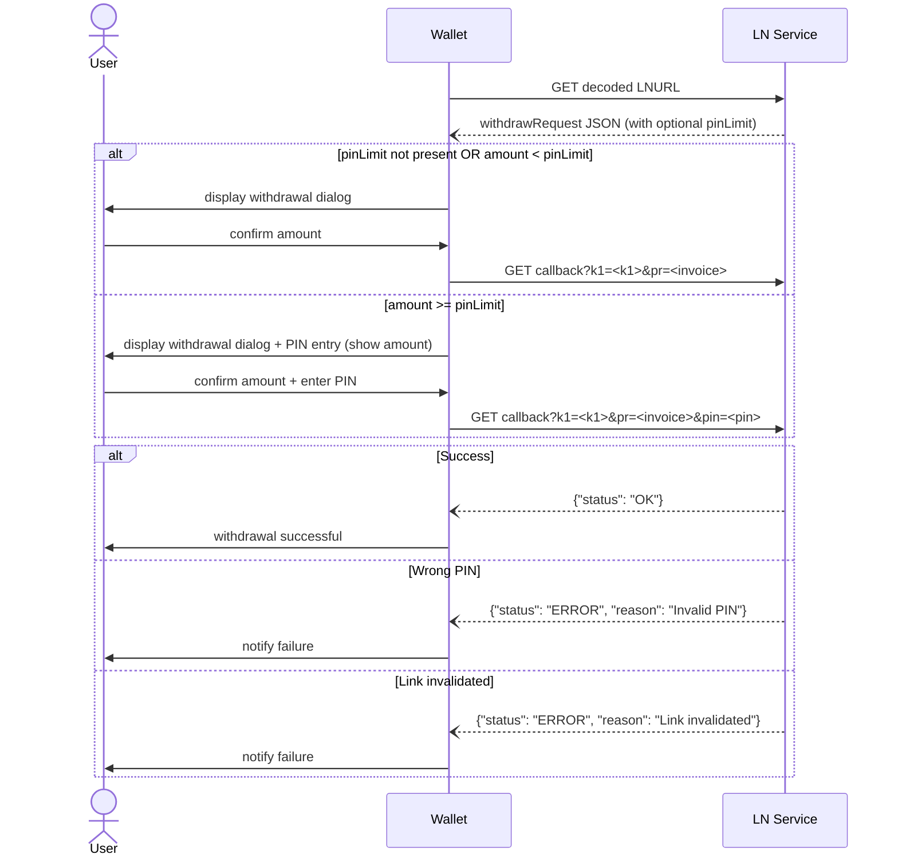

LUD-XX: `pinLimit` for `withdrawRequest`
========================================

`author: titusz` `co-author: AxelHamburch` `supersedes: PR #200` `discussion: https://github.com/lnurl/luds/issues/289`

---

## Optional PIN Authorization for `withdrawRequest`

This document extends [LUD-03](03.md) by adding an optional `pinLimit` field to the
`withdrawRequest` response. When present, it allows a `SERVICE` to require a PIN
from the user before authorizing a withdrawal at or above a given amount.

**Primary use case:** NFC payment devices (e.g. Bolt Cards) that have no battery
and no screen, where a lost or stolen device could otherwise be drained without
the owner's knowledge.

**For services:** `pinLimit` is optional to deploy. Services that do not set it
behave exactly as defined in LUD-03.

**For wallets:** If `pinLimit` is present in the response and `amount >= pinLimit`,
PIN entry is **mandatory**. A wallet or terminal that does not support PIN entry
will send the callback without a `pin` parameter — the `SERVICE` MUST reject
that request. There is no fallback or bypass once the threshold is met.

---

## Modified `withdrawRequest` Response

A `SERVICE` MAY include the `pinLimit` field in a standard LUD-03 response:

```typescript
{
    "tag": "withdrawRequest",           // as per LUD-03
    "callback": string,                 // as per LUD-03
    "k1": string,                       // as per LUD-03
    "defaultDescription": string,       // as per LUD-03
    "minWithdrawable": number,          // as per LUD-03
    "maxWithdrawable": number,          // as per LUD-03
    "pinLimit": number                  // NEW (optional): millisatoshi threshold
}
```

`pinLimit` MUST be a positive integer (in millisatoshis). If present and the
intended withdrawal amount is **equal to or greater than** `pinLimit`, the
`WALLET` MUST collect a PIN from the user before proceeding.

---

## Wallet to Service Interaction Flow



---

## Modified Callback Request

When a PIN is required, the `WALLET` appends it as a query parameter:

```
<callback>
  <?|&>
  k1=<k1>
  &pr=<lightning invoice>
  &pin=<pin>
```

**Example:**
```
https://ln-example.com/withdraw?k1=abc123&pr=lnbc...&pin=1234
```

---

## PIN Specification

- **Length:** exactly 4 digits (numeric only)
- **Transmission:** appended to callback URL as plaintext `pin=` parameter
- **Transport security:** HTTPS is REQUIRED for all callbacks involving `pinLimit`
- The `WALLET` MUST display the invoice amount on the same screen as the PIN entry

> **Note on PIN visibility:** The PIN is visible to the point-of-sale device
> during entry. This is an accepted trade-off for the NFC use case. Transport
> encryption (HTTPS/TLS) protects against network interception. Services MAY
> additionally hash PINs at rest.

---

## Wallet Implementation Requirements

1. If `pinLimit` is present and `amount >= pinLimit`, the `WALLET` MUST collect a
   PIN before sending the callback.
2. The `WALLET` MUST NOT auto-propose an amount solely based on `pinLimit`.
3. The PIN entry screen MUST display the invoice amount.
4. The `WALLET` MUST collect exactly 4 digits as the PIN.
5. If `pinLimit` is absent, or `amount < pinLimit`, the `WALLET` proceeds per
   LUD-03 without any PIN step.

---

## Service Implementation Requirements

1. If `pinLimit` is present in the response and the withdrawal amount is at or
   above the threshold, the `SERVICE` MUST require the `pin` query parameter.
   If `pin` is absent or invalid, the `SERVICE` MUST reject the request with
   an error response. There is no fallback — terminals without PIN support will
   be rejected.
2. The `SERVICE` MUST invalidate the LNURL link after **3 consecutive PIN
   failures** to prevent brute-force attacks.
3. This document makes no assumption about whether PINs are static or one-time
   passwords (OTPs) — that is a service-level implementation decision.
4. HTTPS is REQUIRED on all callback URLs that use `pinLimit`.

---

## Error Responses

| Condition | `reason` string |
|---|---|
| Wrong PIN (attempts remaining) | `"Invalid PIN"` |
| Link invalidated after 3 failures | `"Link invalidated"` |

Both follow the standard LUD-03 error format:
```json
{"status": "ERROR", "reason": "..."}
```

---

## Security Considerations

- **Lost/stolen NFC device:** `pinLimit` limits exposure to low-value taps only.
  High-value withdrawals require PIN confirmation.
- **PIN at PoS:** The PIN is seen by the merchant terminal. This is acceptable
  in the same way a card PIN at a payment terminal is accepted in traditional
  payments.
- **Brute force:** The mandatory 3-attempt limit and link invalidation prevent
  automated attacks.
- **Replay:** Inherits LUD-03 replay protection via ephemeral `k1`.

---

## Known Implementations

The following implementations exist prior to this LUD being assigned a number,
demonstrating production readiness:

| Project | Role | Notes |
|---|---|---|
| [Bolt Card Wallet](https://github.com/boltcard/boltcard-wallet) | Wallet | Full support |
| [Bolt Card PoS](https://github.com/boltcard/boltcard-pos) | Wallet/PoS | Full support |
| [SwissBitcoinPay boltcard-tools](https://github.com/SwissBitcoinPay/boltcard-tools-terminal) | Service | Full support |
| [LifPay](https://lifpay.me) | Service | Supports 4–12 digit PINs |

---

## Prior Art

- **PR #200** (`LUD-21: pinLimit for withdrawRequest`, Feb 2023): Original proposal
  by @titusz. Technically sound, received 2 approvals, implemented in production.
  Not merged due to number conflict (LUD-21 was assigned to the `verify` spec)
  and unresolved governance questions.
- This document is a clean resubmission of that work, with updated PIN length
  range, explicit HTTPS requirement, and alignment with the governance discussion
  in issue #NEW.
