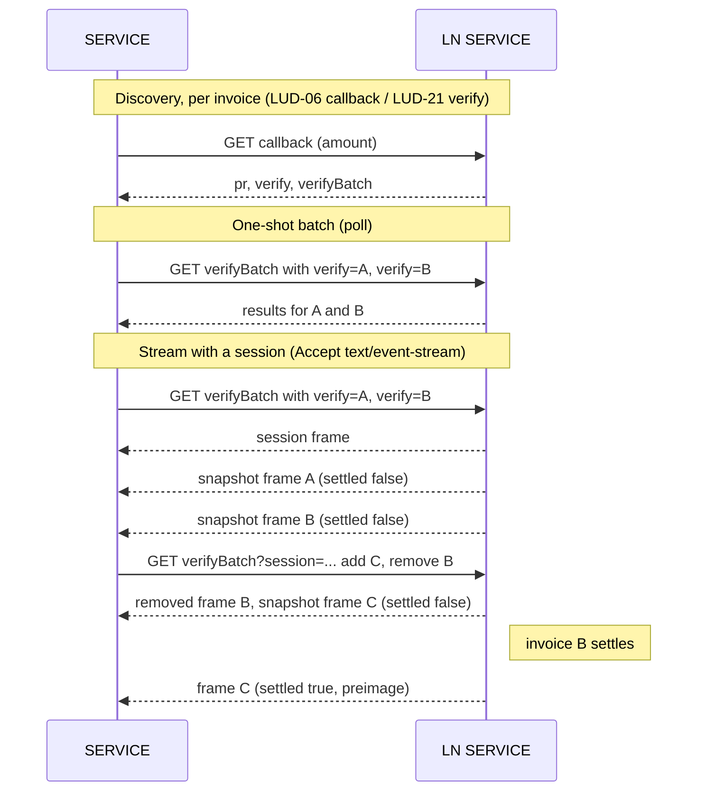

LUD-XX: `verifyBatch`: batched and streamed settlement checking.
================================================================

`author: Kukks` `draft`

---

## Motivation

LUD-21 issues one `verify` URL per invoice, checked with one GET. A `SERVICE` tracking N pending invoices makes N requests per poll cycle, and detection latency is bounded below by the poll interval. For a merchant payment processor backed by an LNURL-pay endpoint (e.g. a BTCPay Server instance configured with a Lightning address), N can be many concurrently pending invoices against a single `LN SERVICE`, and checkout UX wants sub-second settlement. Polling makes that O(N) requests per interval for rarely-changing state, and still leaves a latency floor.

`verifyBatch` is a single endpoint that checks many invoices at once and can be read either as a one-shot response or as a live stream. One GET covers a whole set of pending invoices; kept open as a stream, it pushes settlements as they happen, and the tracked set grows and shrinks in place with plain GET requests to the same endpoint, without reopening the connection. It is optional and strictly additive, and inherits LUD-21's trust model exactly: a caller only ever learns about `verify` URLs it already holds. There is no endpoint-wide or unauthenticated exposure. The per-invoice LUD-21 `verify` GET is unchanged and remains the source of truth. This spec extends LUD-06 (`payRequest`) and LUD-21 (`verify`).

A separately proposed long-held-request extension to LUD-21 `verify` (see [lnurl/luds#281](https://github.com/lnurl/luds/pull/281)) removes the latency floor for a *single* invoice by holding one request open per `verify` URL. `verifyBatch` generalises that to a whole pending set on one connection, and additionally collapses the N-requests-per-poll cost that long-polling a single endpoint does not address. The two are compatible: an `LN SERVICE` MAY offer either, both, or neither, and a single invoice always reduces to a plain LUD-21 `verify` GET.

## Flow



## Discovery

A new optional field `verifyBatch` is added to the LUD-06 `callback` response, alongside `verify`:

```json
{
  "status": "OK",
  "routes": [],
  "pr":     "lnbc10...",
  "verify":      "https://example.com/verify/894e7f7e...",
  "verifyBatch": "https://example.com/verify/batch"
}
```

As a TypeScript-style definition, the added field is:

```Typescript
{
  verifyBatch: string // URL of the batch/stream endpoint; the same value for every invoice this LN SERVICE issues
}
```

An `LN SERVICE` MAY also include `verifyBatch` in LUD-21 `verify` responses, so already-deployed clients can pick it up mid-flight without creating a new invoice.

An `LN SERVICE` SHOULD return the same `verifyBatch` URL for every invoice it issues; it is one endpoint serving many invoices, not per-invoice. Clients deduplicate by URL.

## Request

The client passes the `verify` URLs it wants to check as repeated `verify` query parameters:

```
GET https://example.com/verify/batch?verify=https%3A%2F%2Fexample.com%2Fverify%2F894e7f7e...&verify=https%3A%2F%2Fexample.com%2Fverify%2Fab01cd23...
```

The same endpoint answers in two ways, chosen by the `Accept` header:

- default (no `text/event-stream`): a one-shot JSON snapshot.
- `Accept: text/event-stream`: an SSE stream, snapshot first then live settlements.

A client wanting a plain batch poll uses the default. A client wanting push uses the stream and keeps it open; reading only the snapshot and closing is equivalent to a poll. Because it is a GET with no body, the stream can be opened directly with browser `EventSource`.

Only `verify` URLs the `LN SERVICE` itself issued are answerable; see the issuance rule below. `verify` URLs are opaque to the client, so it sends each one whole rather than a derived identifier. A `verify` URL supplied more than once in a single request is treated once: the one-shot response keys collapse duplicates and the stream emits one snapshot frame per distinct URL.

An `LN SERVICE` that caps how many `verify` URLs one request may carry SHOULD answer a request over its cap with `414`, the status clients already split on (see Client behavior), rather than a generic `400` a client cannot act on.

### Detecting stream support

There is no capability field; support is discovered by content negotiation on the response. The client sends `Accept: text/event-stream` and inspects the response `Content-Type`:

- `text/event-stream` → the `LN SERVICE` supports streaming; the client consumes frames.
- anything else (a `SERVICE` that does not stream ignores the header, per LUD-01, and returns the one-shot JSON) → the client parses that body as the one-shot response and knows to poll from then on.

The attempt is never wasted: whichever representation comes back is the current settlement snapshot, so a client that hoped for a stream but got JSON already has its answer and simply continues by polling. A `SERVICE` fronted by a strict layer that rejects the header with `406` is treated the same as "no stream": the client reissues the GET without the event-stream `Accept`.

In a browser, an `EventSource` sends `Accept: text/event-stream` on its own — this is what drives the negotiation above — and it reconnects automatically on error. So a client that receives a non-`text/event-stream` body, or an `onerror` before any frame, MUST call `.close()` on the `EventSource` before falling back to a plain `fetch` GET, otherwise it will reconnect-loop against an endpoint that will never stream.

An `LN SERVICE` that streams MUST ensure intermediaries do not buffer the response (`Content-Type: text/event-stream` is the signal for this); a buffering proxy would preserve correctness but destroy the latency the stream exists for.

## One-shot response

Served as `application/json`. Because settlement state is live, the response MUST NOT be cached; the `LN SERVICE` SHOULD set `Cache-Control: no-store`, as it does for the single LUD-21 `verify` GET.

A well-formed request returns HTTP `200` with a `results` object keyed by the requested `verify` URL. Each value is the same object a single LUD-21 `verify` GET would return, or a per-item error for a URL the `LN SERVICE` did not issue:

```json
{
  "status": "OK",
  "results": {
    "https://example.com/verify/894e7f7e...": { "status": "OK", "settled": true,  "preimage": "123456...", "pr": "lnbc10..." },
    "https://example.com/verify/ab01cd23...": { "status": "OK", "settled": false, "preimage": null,        "pr": "lnbc10..." },
    "https://example.com/verify/ffff0000...": { "status": "ERROR", "reason": "unknown verify url" }
  }
}
```

As TypeScript-style definitions:

```Typescript
// top-level one-shot response
{
  status: "OK",
  results: {
    [verifyUrl: string]: VerifyResult | VerifyError
  }
}

// a single settlement result, identical to a LUD-21 `verify` response
type VerifyResult = {
  status: "OK",
  settled: boolean,
  preimage: string | null, // hex preimage once settled, otherwise null
  pr: string               // the bech32 invoice
}

type VerifyError = {
  status: "ERROR",
  reason: string
}
```

Per-item failures never change the top-level status: a well-formed request is `200` with `status: "OK"` even when every entry in `results` is an `ERROR`, and the response MUST include an entry for every presented URL. A top-level `ERROR` is reserved for a malformed request — for example no `verify` parameter supplied — in which case the `LN SERVICE` returns `{ "status": "ERROR", "reason": "..." }` with an appropriate `4xx`, matching the LUD-06/LUD-21 error shape.

## Streamed response

With `Accept: text/event-stream`, the endpoint covers exactly the presented set: current state first, live settlements after, on one connection.

- The `LN SERVICE` first emits the session frame (see Stream sessions below), then one `data:` frame per presented `verify` URL carrying its current state (this burst is the snapshot; it includes still-pending invoices as `settled: false` and unknown URLs as `ERROR`). It then holds the connection open and emits a further frame only when a still-pending presented invoice settles.
- Stream frames arrive individually and cannot share a map key, so each frame is a single result object that MUST include its `verify` field for correlation:

```
data: {"verify": "https://example.com/verify/894e7f7e...", "status": "OK", "settled": false, "preimage": null, "pr": "lnbc10..."}

data: {"verify": "https://example.com/verify/ab01cd23...", "status": "OK", "settled": true, "preimage": "789abc...", "pr": "lnbc10..."}
```

An unknown URL appears in the snapshot burst as an error frame carrying the same `verify` field for correlation:

```
data: {"verify": "https://example.com/verify/ffff0000...", "status": "ERROR", "reason": "unknown verify url"}
```

As a TypeScript-style definition, each frame's JSON is a `VerifyResult` or `VerifyError` (as above) with the echoed `verify` URL added:

```Typescript
{ verify: string } & (VerifyResult | VerifyError)
```

- The tracked set starts as the presented set and MAY be updated in place while the connection stays open, using the stream's session (see Stream sessions below). An `LN SERVICE` that does not offer sessions simply sends no session frame; the client then falls back to reopening with its current pending set, whose snapshot also serves as reconciliation. An `LN SERVICE` MUST NOT require any mechanism other than the session update GET to mutate a live stream.
- The `LN SERVICE` MAY close the connection once every tracked invoice is settled or expired, or after a maximum duration; the client reopens as needed. It SHOULD send an SSE comment line (`: keepalive`) periodically (RECOMMENDED at least every 30 seconds) so intermediaries do not drop idle connections.
- Invoice expiry is not streamed; the client already holds each invoice's expiry time and drops expired ones locally.

### Stream sessions

Every stream has a session identifying the set it tracks. The first frame of any stream is the session frame:

```
event: session
data: {"session": "d41d8cd9..."}
```

A client listens for `session`; a client whose first received frame is a `data:` result frame knows the stream cannot be updated and falls back to reopening with its current pending set. The `session` value is an unguessable bearer capability usable only while the connection it belongs to is open: the `LN SERVICE` MUST generate it with at least 128 bits of entropy and MUST NOT accept it once the stream has closed. The session is created by the streamed GET itself.

While the stream stays open, the client mutates the tracked set with:

```
GET https://example.com/verify/batch?session=d41d8cd9...&add=https%3A%2F%2Fexample.com%2Fverify%2Fcd01ef45...&remove=https%3A%2F%2Fexample.com%2Fverify%2Fab01cd23...
```

As TypeScript-style definitions, the update request and its response are:

```Typescript
// first frame of a stream that supports updates
type SessionFrame = {
  session: string
}

// GET verifyBatch?session=... request
{
  add?: string[],
  remove?: string[]
}

// GET verifyBatch?session=... response
{
  status: "OK"
}
```

Update rules:

- The request MUST include `add`, `remove`, or both as query parameters; a request with `session` and neither of them is malformed and answered with a top-level `ERROR` and an appropriate `4xx`, like the one-shot case. The update GET itself answers as an LNURL-style JSON response, `200` with `{"status": "OK"}`; the effects arrive as frames on the live stream, never in the update response. Updates are idempotent: replaying one (for example after an interrupted request) causes no duplicate frames.
- For each added URL that is not already tracked, exactly one frame is emitted on the stream: the snapshot result, or an error frame for a URL the `LN SERVICE` did not issue. Live settlement frames follow for it as usual. A URL the session already tracks is a no-op and emits nothing.
- For each removed URL that is tracked, exactly one removal frame is emitted, and the `LN SERVICE` stops tracking it, so no settlement frames follow. A URL the session does not track is a no-op. The removal frame is emitted even if the invoice had already settled; the client MAY ignore it. The frame echoes the `verify` URL byte-for-byte like every other frame:

```
event: removed
data: {"verify": "https://example.com/verify/ab01cd23..."}
```

- Clients SHOULD remove expired or cancelled invoices from the session instead of leaving them tracked until expiry, keeping the service's per-connection state minimal. One connection per batch endpoint then serves a merchant indefinitely: new invoices are appended with one session update, never with a reopen.
- An `LN SERVICE` MAY cap the size of a session's tracked set or the rate of updates; a rejected update is answered with a top-level `ERROR` (`4xx`) and changes nothing.

## Rules (both response types)

- Auth is by capability, exactly as LUD-21: possession of a `verify` URL is what authorizes reading its settlement state and `preimage`. Because the caller presents each `verify` URL, results MAY include `preimage`/`pr`, identical to the single-invoice `verify` response.
- The `LN SERVICE` MUST treat each supplied `verify` URL as an identifier to look up against the verify records it itself issued, NOT as a URL to fetch. It performs no outbound request for a supplied URL. For any URL it did not issue, it returns `{"status": "ERROR", "reason": "unknown verify url"}` for that item. Because the input is never fetched, there is no server-side request forgery surface. This is an issuance check, not an origin check: an `LN SERVICE` reachable under multiple hostnames, or one honouring verify URLs from a prior domain, MAY recognise all of them as its own. It MAY decide issuance by the identifier it embedded in the URL (for example a payment hash in the path) rather than by the whole string, provided that identifier alone is what authorizes its single-invoice `verify` GET: answering a variant spelling then discloses nothing that URL's own `verify` GET would not.
- Every `verify` value returned (map key in one-shot, `verify` field in a frame) MUST be the exact string the client sent, echoed byte-for-byte. `verify` URLs are opaque strings stored verbatim from the `callback`/`verify` response, so the server MUST NOT canonicalise them (trailing slash, host case, query order); a rewritten value would not match the client's lookup.
- A client MUST validate `SHA256(preimage) == paymentHash` for any returned preimage before treating an invoice as proven, the same as it would for a single `verify` response.

## Client behavior

1. Track `(paymentHash -> verify URL)` per invoice as in LUD-21.
2. Group pending invoices by the `verifyBatch` URL advertised alongside each `verify` URL. For each distinct `verifyBatch` URL, request its group. If a group's URL grows too long and the `SERVICE` returns `414` or `431`, split it across more than one request (or, for the stream, more than one connection); a stream can alternatively be opened with its first chunk and grown to the full set by successive session update requests, so no single URL has to carry the whole set. Whether the grouped `verify` URLs share a host with the batch endpoint is the `LN SERVICE`'s concern, not the client's.
3. To poll: GET without the event-stream `Accept`, read the `results`, repeat on an interval. To receive push: GET with `Accept: text/event-stream` (via `EventSource` in a browser) over the group's set, process the session frame then snapshot frames then live frames. While the connection stays open and a session frame was received, add and remove invoices with session update GETs instead of reopening. Reopen only when the connection closes, when the service provides no session, or when the tracked set outgrows the service's session cap (the reopen snapshot is also the reconciliation).
4. For any `settled: true` result or frame, validate `SHA256(preimage) == paymentHash` and mark the invoice paid.
5. If `verifyBatch` is absent, fall back to plain per-invoice LUD-21 polling. A client MAY mix: batch or stream the endpoints that support it, poll the rest. For a single invoice, plain LUD-21 GET `verify` is sufficient.

For a merchant whose pending set fits one request, this is one request per poll, or one open connection matching its pending stream, updated in place as new invoices appear. Settlement latency on a stream is roughly network round-trip. Larger sets split across a few requests or grow incrementally from one stream, still far below one request per invoice.

## Backwards compatibility

- The `verifyBatch` field and the streamed representation are optional. A LUD-21-only `LN SERVICE` or client is unaffected.
- Stream sessions are optional. A client that reopens streams instead of updating them is unaffected: a service without sessions sends no session frame.
- `verify` GET semantics are unchanged and authoritative.
- A client that ignores `verifyBatch` keeps working exactly as today.
- An `LN SERVICE` can roll out incrementally: add the one-shot response first, add the stream later, advertise `verifyBatch` only on new invoices or retrofit it into `verify` responses.

## Security and privacy considerations

- Every mechanism here inherits LUD-21's trust model. A caller learns only about `verify` URLs it already holds, whether it asks one at a time, in a batch, or over a stream. There is no aggregate exposure: a caller cannot enumerate, observe, or subscribe to invoices it did not create. (This is why the stream is scoped to presented capabilities rather than offered as an endpoint-wide feed, which would leak settlement activity to anyone able to create an invoice at a public address.)
- No mechanism fetches a caller-supplied URL, so none introduces a request-forgery surface (see the issuance rule).
- Preimages appear only in results gated by a presented `verify` capability, and MUST always be validated against the payment hash by the client.
- The `session` identity is a bearer capability: possession lets a caller track the stream's future settlement frames, including preimages, and add or remove its tracked `verify` URLs. Possessing a session is therefore equivalent to possessing every `verify` URL tracked by it, and it MUST be high-entropy and unguessable. Because updates accept only `verify` URLs the `LN SERVICE` itself issued, a leaked session cannot enumerate other invoices; it can only watch or disturb invoices already tracked by it.
- An `LN SERVICE` MAY rotate its `verifyBatch` URL by returning the new URL in subsequent `callback`/`verify` responses; clients migrate on next discovery.
- Endpoints SHOULD be rate limited like any other public endpoint. Splitting a large set across many requests, opening sessions rapidly, or sending frequent session updates is not bounded by any single request; an `LN SERVICE` MAY additionally rate limit by caller, cap concurrent streams, and cap updates per session.
