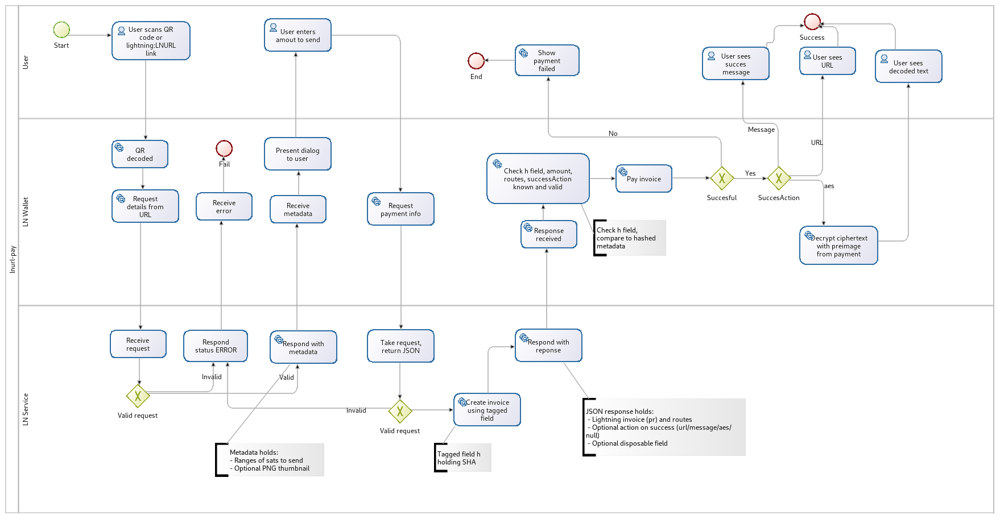

# LNURL-pay

## Pay to static QR/NFC/link

### Wallet to service interaction flow:


**Either**  
1.1.1. User scans a LNURL QR code or pastes/shares an `lightning:LNURL..` link with `LN WALLET` and `LN WALLET` decodes LNURL.  
1.1.2. `LN WALLET` makes a GET request to `LN SERVICE` using the decoded LNURL.  
**Or**   
1.2.1. User scans/pastes/shares an [internet identifier](https://datatracker.ietf.org/doc/html/rfc5322#section-3.4.1) with `LN WALLET`.  
1.2.2. `LN WALLET` extracts `domain` and `user` parts from identifier, makes a GET request to `https://<LN SERVICE domain>/.well-known/lnurlp/<user>` endpoint if `domain` is clearnet or `http://<LN SERVICE domain>/.well-known/lnurlp/<user>` if `domain` is onion, an example for `payments@site.com` is GET `https://site.com/.well-known/lnurlp/payments`.  
**Then**  
2. `LN WALLET` gets JSON response from `LN SERVICE` of form:

    ```
    {
        callback: String, // the URL from LN SERVICE which will accept the pay request parameters
        maxSendable: MilliSatoshi, // max amount LN SERVICE is willing to receive
        minSendable: MilliSatoshi, // min amount LN SERVICE is willing to receive, can not be less than 1 or more than `maxSendable`
        metadata: String, // metadata json which must be presented as raw string here, this is required to pass signature verification at a later step
        commentAllowed: Number, // optional number of characters accepted for the `comment` query parameter on subsequent callback, defaults to 0 if not provided. (no comment allowed)
        tag: "payRequest" // type of LNURL
    }
    ```
    or

    ```
    {"status": "ERROR", "reason": "error details..."}
    ```

    `metadata` json array must contain one `text/plain` entry, all other types of entries are optional.
    `metadata` json array must contain either one `text/email` entry or one `text/identifier` entry or nethier.

    ```
    [
        [
            "text/plain", // must always be present
            content // actual metadata content
        ],
        [
            "image/png;base64", // optional 512x512px PNG thumbnail which will represent this lnurl in a list or grid
            content // base64 string, up to 136536 characters (100Kb of image data in base-64 encoding)
        ],
        [
            "image/jpeg;base64", // optional 512x512px JPG thumbnail which will represent this lnurl in a list or grid
            content // base64 string, up to 136536 characters (100Kb of image data in base-64 encoding)
        ],
        [
            "text/email", // optional indication that this payment link is associated with an email address
            content // an email string in standard user@site.com format
        ],
        [
            "text/identifier", // optional indication that this payment link is associated with an internet identifier string
            content // an internet identifier string in standard user@site.com format
        ]
        ... // more objects for future types
    ]
    ```

    and be sent as a string:

    ```
    "[[\"text/plain\", \"lorem ipsum blah blah\"]]"
    ```

3. `LN WALLET` displays a payment dialog where user can specify an exact sum to be sent which would be bounded by:

	```
	max can send = min(maxSendable, local estimation of how much can be sent from wallet)

	min can send = max(minSendable, local minimal value allowed by wallet)
	```
	Additionally, a payment dialog must include:
	- Domain name extracted from `LNURL` query string.
	- A way to view the metadata sent of `text/plain` format.
	- A text input where user can enter a `comment` string (max character count is equal or less than `commentAllowed` value)

4. `LN WALLET` makes a GET request using

	```
	<callback><?|&>amount=<milliSatoshi>&nonce=<hex(8 bytes of random data)>&fromnodes=<nodeId1,nodeId2,...>&comment=<String>&proofofpayer=<hex(ephemeral secp256k1 public key bytes)>
	```

	This corresponds to the following query parameters:

  - `amount` - user specified sum in MilliSatoshi
  - `nonce` - an optional parameter used to prevent server response caching
  - `fromnodes` - an optional parameter with value set to comma separated `nodeId`s if payer wishes a service to provide payment routes starting from specified LN `nodeId`s
  - `comment` - an optional parameter to pass the LN WALLET user's `comment` to LN SERVICE
  - `proofofpayer` - an optional ephemeral secp256k1 public key generated by payer, a corresponding private key should be retained by payer, a payee may later ask payer to provide a public key itself or sign a random message using corresponding private key and thus provide a proof of payer.

  * Note on `comment` length: [GET URL's accept around ~2000 characters for the entire request string](https://stackoverflow.com/a/417184). Therefore `comment` can only be as large as to fit in the URL alongisde any/all of the properties outlined above.*

5. `LN Service` takes the GET request and returns JSON response of form:

	```
	{
		pr: String, // bech32-serialized lightning invoice
		successAction: Object or null, // An optional action to be executed after successfully paying an invoice
		disposable: Boolean or null, // An optional flag to let a wallet know whether to persist the link from step 1, if null should be interpreted as true
		routes:
		[
			[
				{
					nodeId: String,
					channelUpdate: String // hex-encoded serialized ChannelUpdate gossip message
				},
				... // next hop
			],
			... // next route
		] // array with payment routes, should be left empty if no routes are to be provided
	}
	```

	or

	```
	{"status":"ERROR", "reason":"error details..."}
	```

	`pr` must have the [`h` tag (`description_hash`)](https://github.com/lightningnetwork/lightning-rfc/blob/master/11-payment-encoding.md#tagged-fields) set to `sha256(utf8ByteArray(metadata))`.

	Currently supported tags for `successAction` object are `url`, `message`, and `aes`. If there is no action then `successAction` value must be set to `null`.

	```
	{
	   tag: String, // action type
	   ... rest of fields depends on tag value
	}
	```

	Examples of `successAction`:

    ```
	{
	   tag: 'url'
	   description: 'Thank you for your purchase. Here is your order details' // Up to 144 characters
	   url: 'https://www.ln-service.com/order/<orderId>' // url domain must be the same as `callback` domain at step 3
	}

	{
	   tag: 'message'
	   message: 'Thank you for using bike-over-ln CO! Your rental bike is unlocked now' // Up to 144 characters
	}

	{
	   tag: 'aes'
	   description: 'Here is your redeem code' // Up to 144 characters
	   ciphertext: <base64> // an AES-encrypted data where encryption key is payment preimage, up to 4kb of characters
	   iv: <base64> // initialization vector, exactly 24 characters
	}

    ```

6. `LN WALLET` Verifies that `h` tag in provided invoice is a hash of `metadata` string converted to byte array in UTF-8 encoding.
7. `LN WALLET` Verifies that amount in provided invoice equals an amount previously specified by user.
8. If routes array is not empty: verifies signature for every provided `ChannelUpdate`, may use these routes if fee levels are acceptable.
9. If `successAction` is not null: `LN WALLET` makes sure that `tag` value of is of supported type, aborts a payment otherwise.
10. `LN WALLET` pays the invoice, no additional user confirmation is required at this point.
11. Once payment is fulfilled `LN WALLET` executes a non-null `successAction`. For `message`, a toaster or popup is sufficient. For `url`, the wallet should give the user a popup which displays `description`, `url`, and a 'open' button to open the `url` in a new browser tab. For `aes`, `LN WALLET` must attempt to decrypt a `ciphertext` with payment preimage. `LN WALLET` should also store `successAction` data on the transaction record.

## Notes on metadata for server-side LNURL-PAY

### When client makes a first call:

Construct a metadata object, turn it into json, then include in into parent json as string.

### When client makes a second call

1. Make a hash as follows: `sha256(utf8ByteArray(unescaped_metadata_string))`.
2. Generate a payment request using an obtained hash.

### Note on `aes` action tag
Used encryption type is 256-bit AES in `AES/CBC/PKCS5Padding` mode.
An encryption example in Scala:

```scala
val iv = Tools.random.getBytes(16) // exactly 16 bytes, unique for each secret
val key = Tools.random.getBytes(32) // payment preimage
val data = "Secret data".getBytes

val aesCipher = Cipher getInstance "AES/CBC/PKCS5Padding"
val ivParameterSpec = new IvParameterSpec(iv)
aesCipher.init(Cipher.ENCRYPT_MODE, new SecretKeySpec(key, "AES"), ivParameterSpec)
val cipherbytes = aesCipher.doFinal(data)

val ciphertext64 = ByteVector.view(cipherbytes).toBase64 // Base 64 alphabet as defined by http://tools.ietf.org/html/rfc4648#section-4 RF4648 section 4. Whitespace is ignored.
val iv64 = ByteVector.view(iv).toBase64 // 16 bytes results in exactly 24 characters
```
