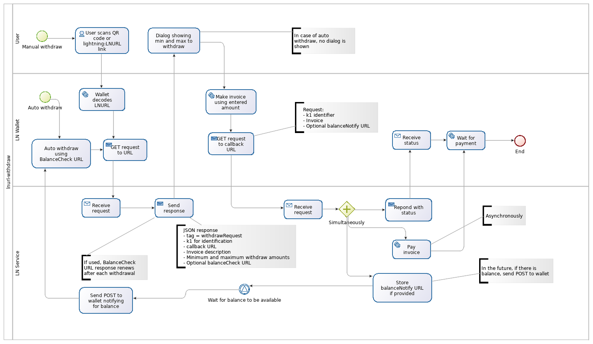

# LNURL-withdraw

## Withdrawing funds from a service

Today users are asked to provide a withdrawal Lightning invoice to a service, this requires some effort and is especially painful when user tries to withdraw funds into mobile wallet while using a desktop website. Instead of asking for Lightning invoice a service could display a "withdraw" QR code which contains a specialized `LNURL`.

### Wallet to service interaction flow:


1. User scans a LNURL QR code or accesses an `lnurl:LNURL..` link with `LN WALLET` and `LN WALLET` decodes LNURL.

2. `LN WALLET` makes a GET request to `LN SERVICE` using the decoded LNURL.

3. `LN WALLET` gets JSON response from `LN SERVICE` of form:
    ```
    {
        tag: "withdrawRequest", // type of LNURL
        callback: String, // the URL which LN SERVICE would accept a withdrawal Lightning invoice as query parameter
        k1: String, // random or non-random string to identify the user's LN WALLET when using the callback URL
        defaultDescription: String, // A default withdrawal invoice description
        minWithdrawable: Integer, // Min amount (in millisatoshis) the user can withdraw from LN SERVICE, or 0
        maxWithdrawable: Integer, // Max amount (in millisatoshis) the user can withdraw from LN SERVICE, or equal to minWithdrawable if the user has no choice over the amounts
        balanceCheck: String, // Optional, an URL that can be called next time the wallet wants to perform a balance check, the call will be the same as performed in this step and the expected response is the same
    }
    ```
    or

    ```
    {"status": "ERROR", "reason": "error details..."}
    ```

4. `LN WALLET` Displays a withdraw dialog where user can specify an exact sum to be withdrawn which would be bounded by:

	```
	max can receive = min(maxWithdrawable, local estimation of how much can be routed into wallet)
	min can receive = max(minWithdrawable, local minimal value allowed by wallet)
	```
5. Once accepted by the user, `LN WALLET` sends a GET to `LN SERVICE` in the form of

	```
	<callback>
      <?|&> // either '?' or '&' depending on whether there is a query string already in the callback
       k1=<k1> // the k1 specified in the response above
      &pr=<lightning invoice> // the payment request generated by the wallet
      &balanceNotify=<URL> // optional, see note below
	```
6. `LN SERVICE` sends a `{"status": "OK"}` or `{"status": "ERROR", "reason": "error details..."}` JSON response and then attempts to pay the invoices asynchronously.
7. `LN WALLET` awaits for incoming payment if response was successful.

Note that service will withdraw funds to anyone who can provide a valid ephemeral `k1`. In order to harden this a service may require autorization (LNURL-auth, email link etc.) before displaying a withdraw QR.

### `balanceCheck`

This _optional_ property is meant to enable automatic delivery of funds from services to wallets. It works as follows:

  * If `LN WALLET` supports the `balanceCheck` scheme and sees a `balanceCheck` property from a withdraw it performs, it may store that URL locally and call it later (for example, at its next startup, or after 24 hours).
  * The URL is to be treated exactly as the URL from an LNURL QR code after bech32-decoding step.
  * The goal of doing this is to see if there is some balance waiting to be withdrawn on that `LN SERVICE`. If there is any the wallet may decide to withdraw it automatically.
  * After calling the `balanceCheck` URL `LN WALLET` must check the response for the presence of a new `balanceCheck` property and replace the previous with the new one -- just erase the previous if there is not a new one.
  * To support this flow `LN SERVICE` only needs to implement a scheme for renewing the `balanceCheck` URL on every call it receives, returning the next URL every time. Then proceed to redeem withdraw requests when they come. `LN SERVICE` may also choose to offer a static LNURL-withdraw endpoint for each user, which can be less safe, but also simplifies implementation, in this case it would just indicate that same endpoint every time as the `balanceCheck` value.

### `balanceNotify`

This _optional_ property works together with `balanceCheck` to make it instant. It works as follows:

  * If `LN SERVICE` supports `balanceCheck`, then `LN WALLET` may decide to send an query-string-encoded HTTP URL along with the payment request when first making a withdrawal.
  * `LN SERVICE` may store that URL and make a blank `HTTP POST` call to it the next time the given user has a balance in its account on the service.
  * Upon receiving that `HTTP POST`, the wallet may decide to perform a balance check and withdraw the funds immediately.
  * The scheme works for custodial wallets, Lightning nodes that that have a domain name and an always-online online presence, and also for noncustodial mobile wallets that have a friendly server online that is able to receive that `HTTP POST` and notify them somehow.


### Fast LNURL-withdraw scheme

Additionally, `LN SERVICE` and `LN WALLET` developers can also choose to implement a _fast LNURL-withdraw_. This implementation reduces the steps involved in the process by putting the data that would be sent by `LN SERVICE` in step 3. as query parameters of the `LN SERVICE` URL accessed in step 1., before it is bech32-encoded.

Eg:

	https://LNserviceURL
	?tag=withdrawRequest
	&k1=String
	&minWithdrawable=MilliSatoshi
	&maxWithdrawable=MilliSatoshi
	&defaultDescription=String
	&callback=String
    &balanceCheck=String

This fast LNURL-withdraw method is not to be confused as an alternative to the original LNURL-withdraw, and is designed to be only be used for `lnurl:`-type links that work between apps. It is not suitable for QR code implementations.

If a `LN SERVICE` developer chooses to implement fast LNURL-withdraw in their app, the encoded URL with query params must still return a JSON response containing data that would be sent in step 3. when a GET request is made to it. This is required so as to be backwards-compatible with `LN WALLET`s which have only implemented the original LNURL-withdraw method.

If a `LN WALLET` developer chooses to implement fast LNURL-withdraw in their app, they will need to handle for both fast and original LNURL-withdraw methods as `LN SERVICE`s mostly use the original method.
